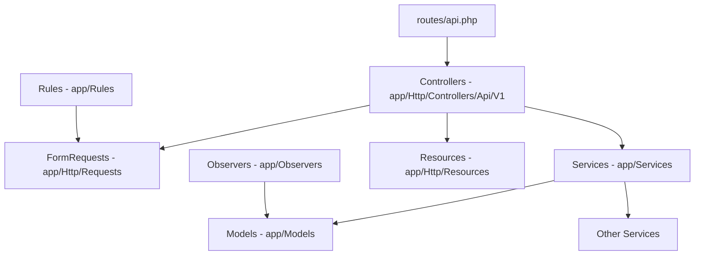
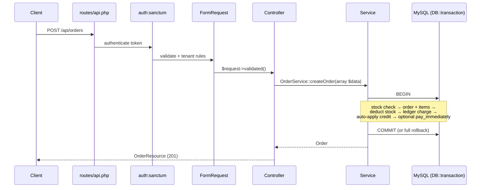

# Backend Architecture Handbook

Laravel REST API, versioned under `/api/v1` conventions (controllers namespaced `Api\V1`), token auth via Sanctum, MySQL.

## Layer model

### Dependency rules (enforced by review, not tooling — yet)

| Layer | May depend on | Must NOT depend on | Why |
|---|---|---|---|
| Controller | FormRequest, Service, Resource, Model (read-only lookups) | Other controllers, raw SQL for business math | Controllers are HTTP adapters. The ledger bug happened because controllers did math. |
| Service | Models, other Services, DB facade | Request objects, Resources, `auth()` where avoidable | Services must be callable from jobs/commands/tests without HTTP. Known debt: `OrderService::createOrder` and `PurchaseOrderService::createPurchaseOrder` call `auth()->user()` directly — new services should take a `User` parameter instead (as `PaymentService` does). |
| Model | Other models (relations) | Services | Models are data + relations + small derived accessors (`Order::isSettled()` is the ceiling of acceptable model logic). |
| FormRequest | Rules | Services | Validation only. All authorization-adjacent checks (`BelongsToTenant`, `OrderBelongsToCustomer`) live in `app/Rules/`. |
| Resource | Models, Services (read-only, e.g. balance lookup) | Mutation of anything | Resources shape output. `OrderResource` may call `LedgerService` to resolve status — reading is fine, writing never. |

**Anti-pattern (real, shipped, fixed):** computing `order.total - payments` in a controller. Three controllers did this independently and disagreed. If you need a balance, call `LedgerService::getBalance()` / `getBalancesForCustomers()` (batch). If the method doesn't exist, add it to `LedgerService`.

## Request lifecycle

## Transactional integrity rule

Any operation that touches **two or more of** {orders, payments, ledger_entries, inventory} MUST run inside a single `DB::transaction`. Existing examples: `OrderService::createOrder`, `cancelOrder`, `PaymentService::processDirectPayment`, `processAutoPayment`, `PurchaseOrderService::createPurchaseOrder`, `cancelPurchaseOrder`. There is no acceptable reason to create a ledger entry outside the transaction that created its reference row.

## Multi-tenancy model

- Every business table carries `tenant_id`. There is no global scope — **scoping is explicit in every query**. This is deliberate (explicit > magic) but it means every new query is a potential leak; the `BelongsToTenant` rule guards inputs, and services re-verify (see the tenant guard block at the top of `PurchaseOrderService::createPurchaseOrder`).
- `users.store_id` nullable: `null` = tenant_admin; otherwise the user belongs to one store.
- Performance indexes on `tenant_id` were added in migration `2026_06_18_085246_add_tenant_performance_indexes_to_tables.php`.

**Future scalability**: if tenant count grows, consider a global `TenantScope` on a `BelongsToTenantModel` base class. Do NOT do this today — a half-applied global scope is worse than consistent explicit scoping.

## Soft-delete map

Soft-deleted (with `->withTrashed()` route bindings for destroy): stores, customers, products, warehouses, orders, purchase orders. **Never soft-deleted**: `ledger_entries`, `inventory_transactions` — these are history. (Note the exceptions to "append-only" documented in [ADR-006](decisions/ADR-006-ledger-mutability-boundaries.md).)

## Observers

`OrderObserver`, `CustomerObserver`, `ProductObserver`, `SupplierObserver`, `StoreObserver` handle lifecycle side-effects. Keep observers for *mechanical* side-effects (cascade cleanups, code generation); money/stock movement belongs in services where it is transaction-controlled and testable.

---

**Related documents**: [ADR index](decisions/README.md), [Coding Standards](../04-engineering-standards/coding-standards.md), [Domain Overview](../06-domain/README.md), [AI Collaboration Guide](../09-ai-collaboration/ai-collaboration-guide.md).
**Future improvements**: extract `auth()->user()` out of `OrderService`/`PurchaseOrderService`; add architecture tests (e.g. `pestphp/pest-plugin-arch` or a phpstan rule) to enforce dependency directions mechanically.
**Open questions**: routes are not actually prefixed `/v1` in `routes/api.php` even though controllers are namespaced `Api\V1` — decide whether to add the URL prefix before the frontend hardcodes more paths.
**Last review checklist**: [ ] layer table matches reality, [ ] transaction rule examples still accurate, [ ] soft-delete map current. Last reviewed: 2026-07-08.
