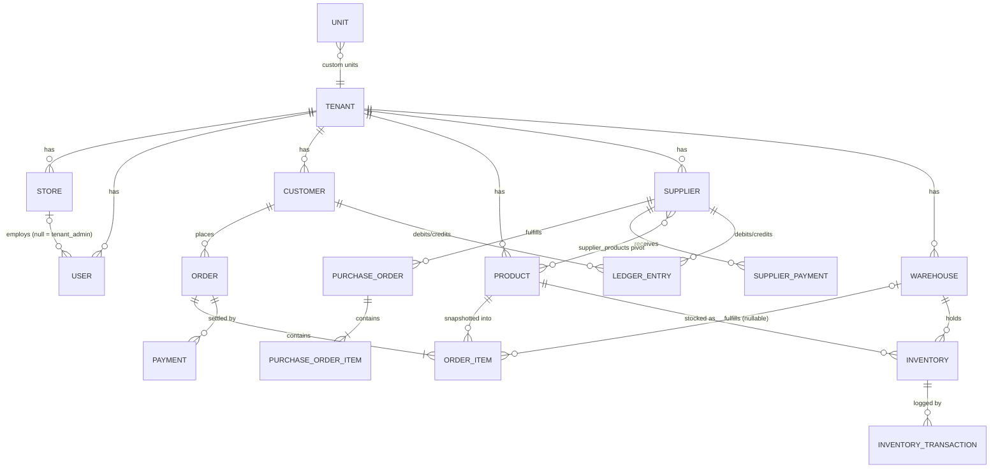

# Domain Overview

MultiDukkan models a small merchant's world: stores selling products to customers (often on credit), stocked from warehouses, replenished from suppliers, with every piastre tracked in one ledger.

## Entity relationship map

## Tenancy

`tenant_id` on every business table, explicitly scoped in every query (no global scope — see [backend-architecture.md](../01-architecture/backend-architecture.md#multi-tenancy-model)). A `Tenant` has many `Store`s; users belong to the tenant and optionally to one store (`store_id` null = `tenant_admin`).

## Entity index

| Entity | Doc | One-line identity |
|---|---|---|
| Customer | [customers.md](customers.md) | Who buys, at which price tier, with what debt |
| Product / Unit | [products-and-units.md](products-and-units.md) | What is sold, at five price tiers, in up to two units |
| Order / OrderItem | [orders.md](orders.md) | A sale: snapshot of what was sold at what price |
| Payment | [payments-and-credit.md](payments-and-credit.md) | Money in, credit applied, refunds out |
| LedgerEntry | [ledger.md](ledger.md) | **The financial source of truth** |
| Inventory / Warehouse / InventoryTransaction | [inventory-and-warehouses.md](inventory-and-warehouses.md) | Where stock physically is, and every movement |
| Supplier / PurchaseOrder / SupplierPayment | [suppliers-and-purchase-orders.md](suppliers-and-purchase-orders.md) | Who we buy from, at what cost, with what debt |

Not yet built (Phase 3): **StockTransfer** — moving inventory between stores with request/approve workflow. Rules are pre-decided in `CLAUDE.md` (source store approves; staff request only; zero ledger entries; atomic `TRANSFER_OUT`/`TRANSFER_IN`).

## Cross-cutting schema notes

- `inventory` table name is **singular** (`protected $table = 'inventory'` on the model).
- `ledger_entries` and `inventory_transactions` have **no soft deletes** — they are history.
- Snapshot columns (`product_name`, `customer_name_snapshot`, `supplier_name_snapshot`, `unit_price`) exist so history survives edits/deletions ([ADR-005](../01-architecture/decisions/ADR-005-snapshot-pricing.md)).
- Invoice numbers: `YYYY-NNN` per tenant per year, generated by max-lookup in `OrderService`/`PurchaseOrderService`. **Known defect**: the parser takes the last 3 chars, so numbering breaks (collides) after 999 in a year — flagged for fix before that volume is reached.

---
**Related documents**: all entity docs above; [Business Rules](../07-business-rules/financial-calculations.md).
**Future improvements**: add `stock-transfers.md` when Phase 3 lands; ERD column-level detail if onboarding pain appears.
**Open questions**: invoice-number fix approach (widen padding vs parse after the dash).
**Last review checklist**: [ ] ERD matches migrations, [ ] entity index complete. Last reviewed: 2026-07-08.
