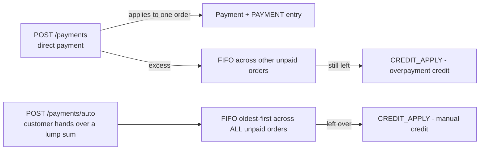

# Payments, Credit & Refunds

A `Payment` row means "value was applied to an order". It is either **real money** (cash/transfer/etc., `is_auto_reversible = false`) or **applied store credit** (`method = 'credit'`, `is_auto_reversible = true`). That flag is load-bearing everywhere: cash flow reports, refund eligibility, cancellation logic.

## Schema highlights

`order_id`, `customer_id`, `amount`, `method` (enum, extended 2026-06-19 — check the migration for the current list), `payment_reference` (external transfer/receipt ref), `refunded_amount` (running counter, never decremented in normal flow), `is_auto_reversible`, `paid_at`.

Effective value of a payment is always **`amount − COALESCE(refunded_amount, 0)`** — every sum in the codebase uses this net form.

## The three payment entry paths (`PaymentService`)

1. **Direct** (`processDirectPayment`): pay a specific order. Rejects if already fully paid. Excess cascades FIFO to the customer's other unpaid orders (each allocation = its own Payment row + `PAYMENT` entry); any remainder becomes overpayment credit.
2. **Auto** (`processAutoPayment`): "the customer gave me 500, sort it out" — allocates FIFO by `created_at` across all unpaid orders; remainder becomes credit via `addCredit`.
3. **Automatic credit consumption** happens at *order creation*, not here (see [order-lifecycle.md](../07-business-rules/order-lifecycle.md)).

FIFO ordering is `created_at asc` — combined with backdated `order_date`, payments settle genuinely-oldest debt first. Intended.

## Credit

Credit = the store owes the customer. Enters via: overpayment leftovers, manual `POST /customers/{c}/credit`, restored credit on cancellation. Leaves via: auto-consumption at order creation (`PAYMENT` + `CREDIT_CONSUMED` pair). Balance: `LedgerService::getCreditBalance()`. Credit payments **cannot be refunded as cash** — cancel the order instead (enforced in `issueRefund`).

## Refunds (`LedgerService::issueRefund`, `POST /customers/{c}/refund`)

Two modes, both capped and both incrementing `refunded_amount`:
- **Specific payment**: cap = that payment's net remaining; blocked for credit payments.
- **Whole order**: cap = order's total net *cash* paid (`cashOnly` scope); distributed FIFO across the order's cash payments.

Result: one `REFUND` ledger entry (debit — see [ledger.md](ledger.md) for why).

## Editing payments

`PATCH /payments/{p}` → `LedgerService::adjustPayment`: updates amount+method and the linked `PAYMENT` entry in place ([ADR-006](../01-architecture/decisions/ADR-006-ledger-mutability-boundaries.md)). Blocked once any refund exists on the payment.

## Known defects (do not silently "fix" — they're tracked)

- `processDirectPayment` throws `new \ValidationException(...)` (nonexistent root-namespace class) on the already-fully-paid path → fatals instead of a 422.
- `adjustPayment` computes `$otherPaymentsTotal` but never uses it — the overpayment-via-edit case isn't validated, so editing a payment upward can silently overpay an order without generating credit.

---
**Related documents**: [Ledger](ledger.md), [Order Lifecycle](../07-business-rules/order-lifecycle.md), [Financial Calculations](../07-business-rules/financial-calculations.md).
**Future improvements**: fix the two defects above; decide whether payment edits should cascade excess like direct payments do.
**Open questions**: should refunds also be possible against credit balances (cash-out of credit) as a first-class flow? Currently only via `REFUND` after payment.
**Last review checklist**: [ ] method enum reference current, [ ] defect list updated after fixes. Last reviewed: 2026-07-08.
