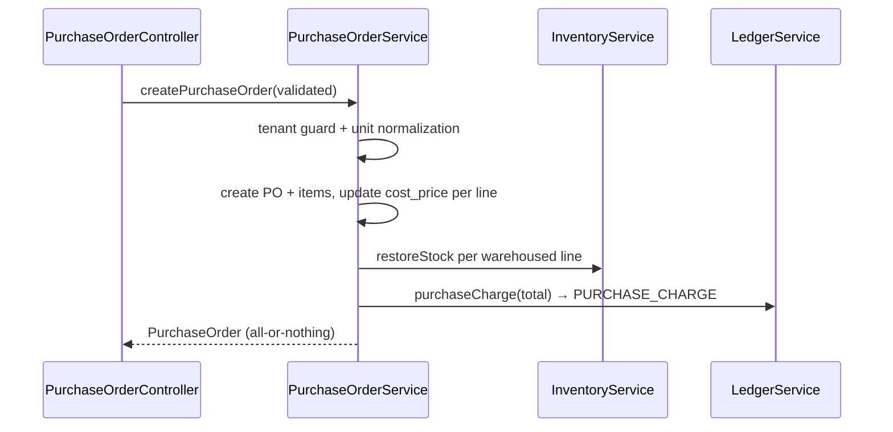

# Suppliers, Purchase Orders & Supplier Payments

The purchasing side mirrors the sales side: PO ≈ order, supplier payment ≈ payment, supplier ledger balance ≈ customer balance — but with **direction-based** ledger entries and **cost averaging** as the extra responsibility.

## Suppliers

Tenant-scoped, soft-deletable. Financial position via `LedgerService::getSupplierBalance()` (positive = tenant owes supplier); lists batch with `getBalancesForSuppliers()`. Sub-resources: `/suppliers/{s}/balance`, `/ledger`, `/summary`, `/products`.

**`supplier_products` pivot** (managed via `SupplierProductController` attach/bulk/update/detach, and auto-updated by every PO): `cost_price`, `last_purchase_price`, `last_purchased_at`, `is_preferred`, `notes`. This is purchasing intelligence per supplier — distinct from the product's blended `cost_price`.

## Purchase orders (`PurchaseOrderService::createPurchaseOrder`)

One transaction, in order:
1. **Tenant guard**: supplier + all products fetched scoped to the tenant; any miss → reject the whole PO (`InvalidArgumentException`). No silent line-dropping.
2. **Unit normalization**: secondary-unit lines converted to base quantity and base-equivalent unit price.
3. PO header created with `supplier_name_snapshot` and its own `YYYY-NNN` invoice sequence (separate from orders; same 999 defect).
4. Per line: item row created (snapshot columns) → **weighted-average `cost_price` recomputed** with the running per-product map ([ADR-008](../01-architecture/decisions/ADR-008-weighted-average-costing.md)) → stock received into the warehouse if one is set (logged, currently as `RETURN` type — see [inventory doc quirk](inventory-and-warehouses.md#transaction-types--service-methods)).
5. Pivot `syncWithoutDetaching` with `last_purchase_price`/`last_purchased_at` (single batched call).
6. `PURCHASE_CHARGE` ledger entry for the PO total (direction: debit).

**Cancellation** (`cancelPurchaseOrder`): deduct received stock back out, `PURCHASE_REVERSAL` for the items subtotal, soft-delete. **`cost_price` is not rewound** — accepted imprecision (ADR-008). POs have no edit endpoints — cancel and recreate is the correction path.

## Supplier payments

`POST /supplier-payments` → `SupplierPaymentService` → `SupplierPayment` row + `SUPPLIER_PAYMENT` ledger entry (direction: credit). Simpler than customer payments: no FIFO allocation, no credit system, no refunds — a payment reduces the supplier balance, done. Keep it that simple until the business asks otherwise.

---
**Related documents**: [Ledger](ledger.md) (supplier schema half), [Costing Rules](../07-business-rules/costing-and-inventory-rules.md), [ADR-008](../01-architecture/decisions/ADR-008-weighted-average-costing.md).
**Future improvements**: PO receiving as a separate step from creation (ordered ≠ received) if the business starts ordering ahead; dedicated PURCHASE inventory transaction types.
**Open questions**: PO update/partial-receive requirements — none yet; supplier payment allocation against specific POs (currently balance-level only, though the description references an invoice number).
**Last review checklist**: [ ] flow matches `PurchaseOrderService`, [ ] pivot columns current. Last reviewed: 2026-07-08.
