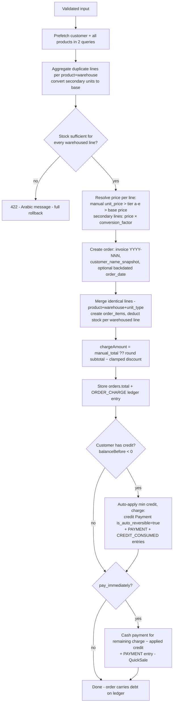
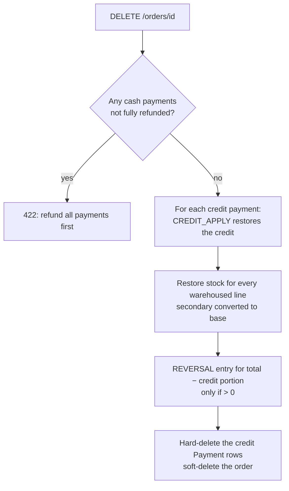

# Order Lifecycle — Create, Pay, Adjust, Cancel

The complete life of a sale. All flows in `OrderService`/`PaymentService`, all inside `DB::transaction` (one known gap noted below).

## Creation (`OrderService::createOrder`)

Key subtleties:
- **Credit is consumed before cash, always, automatically.** The customer cannot owe-and-be-owed simultaneously after a new order (until credit runs out).
- `pay_immediately` pays `chargeAmount − appliedCredit` — never double-pays the credit-covered part.
- Backdating (`order_date`) rewrites `created_at`, which FIFO payment allocation and reports sort by. Intended behavior for entering historical sales.

## Payment (see [payments-and-credit.md](../06-domain/payments-and-credit.md) for the three entry paths)

Status is always derived: **unpaid → partially paid → settled** is a spectrum computed from `Order::settledAmount()` vs `total`. There is no status column and there must never be one.

## Adjustment (post-creation edits)

| Edit | Path | Stock | Ledger |
|---|---|---|---|
| Item quantity/price | `adjustItem` | Delta: deduct increase (with check) / restore decrease | Recompute items − discount → `adjustOrderCharge` |
| Add item | `addItem` (merges into an existing identical line if present) | Check + deduct | same |
| Discount | `updateOrder` | none | same |
| Payment amount/method | `LedgerService::adjustPayment` | none | Edits `PAYMENT` entry in place ([ADR-006](../01-architecture/decisions/ADR-006-ledger-mutability-boundaries.md)); blocked after any refund |

⚠️ `adjustItem` currently lacks a `DB::transaction` wrapper (unlike `addItem`) — a mid-flight failure can deduct stock without updating the ledger. Known gap; wrap it when next touched.

## Cancellation (`cancelOrder` = soft delete + full unwind)

Why this shape: cash must physically leave via the refund flow first (auditable `REFUND` entries); credit merely returns to the pool it came from. The credit-payment rows are deleted (not soft) because `is_auto_reversible` payments are bookkeeping artifacts, not money events — the ledger entries they produced remain, keeping balance math exact.

Net ledger effect of create→cancel is always zero. Worked example, 100 EGP order paid 30 by credit: create → CHARGE 100 (d), PAYMENT 30 (c), CREDIT_CONSUMED 30 (d); cancel → CREDIT_APPLY 30 (c), REVERSAL 70 (c). Debits 130 = credits 130 ✓, and the 30 credit is available again ✓.

---
**Related documents**: [Orders](../06-domain/orders.md), [Payments & Credit](../06-domain/payments-and-credit.md), [Financial Calculations](financial-calculations.md).
**Future improvements**: transaction-wrap `adjustItem`; decide whether cancelling should be blocked or cascaded when items were partially adjusted after payments.
**Open questions**: is un-cancelling (restore) ever needed? Currently impossible (stock/ledger unwound).
**Last review checklist**: [ ] flowcharts match `OrderService` code paths, [ ] worked example still balances. Last reviewed: 2026-07-08.
