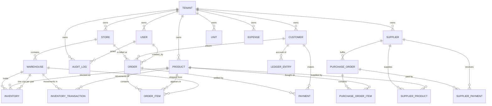

# MultiDukkan — Database Guide

Read straight from `database/migrations/` (55 files) and `app/Models/` on 2026-08-30. MySQL/InnoDB
everywhere, including the test suite (`phpunit.xml` → `multidukkan_test`).

Labels: ✅ Confirmed · 🔍 Inferred · ❓ Unclear · ⚠️ Potential issue.

**Two conventions to know before reading anything else:**

1. **`$table->datetimes()`** is used instead of `timestamps()` — the columns are `DATETIME`, not
   `TIMESTAMP`. Deliberate (commit `d7ce031`): `TIMESTAMP` silently converts on read/write according
   to the session timezone; `DATETIME` stores exactly what you give it. The app writes UTC and the
   MySQL session is pinned to UTC, so no conversion ever happens implicitly.
2. **`datetimes(6)`** (microsecond precision) on `ledger_entries`, `inventory_transactions` and
   `audit_logs` — so events written milliseconds apart in one request still sort correctly in the
   activity feed.

---

## Conceptual relationship map



**Ledger note**: `ledger_entries` serves *both* customers and suppliers from one table, using two
different column sets. The ERD above shows only the customer edge because the supplier edge is not a
real FK — it is `entity_type = 'supplier'` + `entity_id`, with no constraint behind it. ⚠️

---

## Table reference

Legend for the "Lifecycle" row: **Mutable** = rows are updated in normal operation ·
**Append-only** = written once, never updated · **Snapshot** = written once as a historical copy.

---

### `tenants`

| | |
|---|---|
| **Purpose** | One row per business. The isolation boundary for everything else. |
| **PK** | `id` |
| **Columns** | `name`, `created_at`, `updated_at` |
| **Created by** | `POST /register` only (`AuthController::register`) |
| **Lifecycle** | Mutable in principle; **no update or delete endpoint exists** ✅ |
| **Deletion** | Cascades to essentially every table. Not reachable via the API. |

---

### `stores`

| | |
|---|---|
| **Purpose** | A physical branch. Orders are billed at a store; warehouses belong to one. |
| **PK** | `id` · **Tenant** `tenant_id` → `tenants` CASCADE |
| **Columns** | `name`, `address?`, `phone?` |
| **Relationships** | `hasMany` warehouses, orders |
| **Lifecycle** | Mutable |
| **Deletion** | **Hard delete.** Blocked by `StoreObserver::deleting` if it is the tenant's last store, has warehouses, or has unpaid orders. Cascades to `orders` and `warehouses` ⚠️ — the guards are what stop that from firing. |

---

### `users`

| | |
|---|---|
| **Purpose** | Login identity + role + store binding. |
| **PK** | `id` · **Tenant** `tenant_id` CASCADE |
| **Columns** | `store_id?` (→ `stores`, **SET NULL**), `name`, `email` (**globally unique**), `password`, `role` (string, default `store_staff`) |
| **Indexes** | `email` UNIQUE |
| **Lifecycle** | Mutable |
| **Deletion** | Hard. Every reference to a user (`orders.created_by`, `inventory_transactions.user_id`, `ledger_entries.user_id`, `audit_logs.user_id`, `expenses.created_by`) is **SET NULL** — history survives. |
| ⚠️ **Note 1** | `email` is unique *globally*, not per tenant. The same person cannot hold accounts at two businesses. 🔍 Probably not intended, but it is what the schema says. |
| ⚠️ **Note 2** | `User` is the one business model **without** the `ScopedToTenant` trait. All user queries are scoped by hand in `UserController`. |

---

### `products`

| | |
|---|---|
| **Purpose** | The catalogue: what the shop sells, at what prices, in what units, at what cost. |
| **PK** | `id` · **Tenant** `tenant_id` CASCADE |
| **Identity** | `name`, `sku` — UNIQUE `(tenant_id, sku)` |
| **Pricing** | `price` (default) + `price_a`…`price_e` (customer tiers, all nullable → fall back to `price`) |
| **Cost** | `cost_price` — **weighted average per base unit**, maintained by `PurchaseOrderService` (ADR-008) |
| **Units** | `unit` (base, defaults `'pcs'` via `$attributes`), `secondary_unit?`, `conversion_factor?` |
| **Other** | `description`, `description_ar`, `description_en`, `opening_quantity` |
| **Indexes** | `(tenant_id, sku)` UNIQUE, `(tenant_id, name)` |
| **Lifecycle** | Mutable |
| **Deletion** | **Hard delete — no `SoftDeletes` trait.** Guarded by `ProductObserver::deleting` (order items, PO items incl. trashed, stock > 0) and by `order_items.product_id` RESTRICT at the DB level. `Product::booted()` deletes the product's `inventory` rows on the way out. |
| ⚠️ **Danger** | `inventory_transactions.product_id` is CASCADE. A zero-stock product with only manual-adjustment history can be deleted, taking that history with it. See [DOMAIN_RULES.md](DOMAIN_RULES.md) §7. |
| **Stored vs calculated** | Everything stored. `profit_margin*` is computed in `ProductResource`, never persisted. |

---

### `customers`

| | |
|---|---|
| **Purpose** | Who buys, at which tier, and whose ledger accumulates debt. |
| **PK** | `id` · **Tenant** `tenant_id` CASCADE |
| **Columns** | `name`, `phone`, `email?`, `address?`, `area?`, `code?` (`C-001`, generated), `price_tier?` (`null`/`default`/`a`–`e`), `is_walk_in` (bool), `created_by_store_id?` |
| **Indexes** | `(tenant_id, name)`, `(tenant_id, phone)` |
| **Lifecycle** | Mutable · **Soft deleted** (`deleted_at`) |
| **Deletion** | `CustomerObserver::deleting` blocks if any order (incl. trashed), any payment, or a non-zero balance. |
| **Notes** | `created_by_store_id` is tracking only — it never restricts access. Exactly one walk-in customer per tenant, created at registration ("زبون نقدي"), excluded from `/customers` and from dashboard debt figures. |
| ⚠️ | `ledger_entries.customer_id` is CASCADE. A `forceDelete()` would erase the customer's whole financial history with no guard. |

---

### `orders`

| | |
|---|---|
| **Purpose** | One sale. The event that causes stock, ledger and payment writes. |
| **PK** | `id` · **Tenant** `tenant_id` CASCADE |
| **FKs** | `store_id` CASCADE, `customer_id` CASCADE, `created_by` → `users` **SET NULL** |
| **Identity** | `invoice_number` — UNIQUE `(tenant_id, invoice_number)`, format `YYYY-NNN` |
| **Money** | `total` **DECIMAL(12,2)** (wider than everything else, to accommodate `manual_total`), `discount` DECIMAL(10,2) |
| **Dates** | `order_date` DATE (business calendar date — **the label**), `created_at` DATETIME (true UTC instant) |
| **Snapshot** | `customer_name_snapshot` |
| **Indexes** | `(tenant_id, invoice_number)` UNIQUE, `(tenant_id, created_at)`, `(tenant_id, customer_id)` |
| **Lifecycle** | Mutable (narrowly) · **Soft deleted** — cancellation *is* soft delete |
| **Stored vs calculated** | `total` **stored** (ADR-004), written only by `OrderService::createOrder` and `LedgerService::adjustOrderCharge`. **Status is never stored** — derived in `OrderResource`. |
| **Deletion** | `OrderObserver::deleting` blocks while unrefunded cash payments exist. |
| **Why two date columns** | `order_date` is what the merchant writes on the invoice and can backdate. `created_at` is when the row was actually inserted, so an order and its ledger entry always agree about when the system saw it. |

---

### `order_items`

| | |
|---|---|
| **Purpose** | The lines of a sale, frozen at sale time. |
| **PK** | `id` · **No `tenant_id`** — isolated through `order_id` |
| **FKs** | `order_id` → `orders` **RESTRICT**, `product_id` → `products` **RESTRICT**, `warehouse_id?` (nullable, added later) |
| **Snapshot columns** | `product_name`, `unit_price` (ADR-005) |
| **Other** | `quantity` INTEGER, `unit_type` (`base`/`secondary`) |
| **Lifecycle** | Mutable via `OrderService::adjustItem`/`addItem` only, and only while the order is editable |
| **Deletion** | RESTRICT on both parents — the database itself refuses to orphan a line item |
| **Key rule** | An invoice renders `product_name` and `unit_price` from *this* row. Never re-join `products` for historical display. |
| **Null warehouse** | ADR-007's "no warehouse = no stock movement" branch. In practice unreachable for new orders — `StoreOrderRequest` and `StoreOrderItemRequest` both mark `warehouse_id` **required**. 🔍 |

---

### `payments`

| | |
|---|---|
| **Purpose** | Money received against an order (real money *or* store credit). |
| **PK** | `id` · **Tenant** `tenant_id` CASCADE |
| **FKs** | `order_id` CASCADE, `customer_id` CASCADE |
| **Columns** | `amount` DECIMAL(10,2), `refunded_amount` DECIMAL(10,2) default 0, `method` ENUM(`cash`,`bank_transfer`,`instapay`,`vodafone_cash`,`orange_cash`,`check`,`credit`), `is_auto_reversible` BOOL, `paid_at` DATETIME, `payment_reference?` |
| **Lifecycle** | Mutable — `refunded_amount` is incremented; `amount`/`method` editable via `adjustPayment` |
| **Deletion** | Hard, but only in one place: `cancelOrder` deletes the *credit* payment rows after reversing their ledger effect. Cash payments are never deleted. |
| **The two flags that matter** | `is_auto_reversible = true` marks a **store-credit** payment: it settles debt but moved no cash, so it is excluded from refunds, from `cashReceived()`, and from the payments list endpoint. `refunded_amount` is the running counter every refundability check reads. |
| **Scopes** | `cashOnly()` = `is_auto_reversible = false` · `creditOnly()` = true |
| ⚠️ | No index on `order_id` beyond the FK's implicit one, and no `(tenant_id, paid_at)` index despite the dashboard filtering on `paid_at`. 🔍 |

---

### `ledger_entries` — the financial source of truth

| | |
|---|---|
| **Purpose** | Append-only history of everything that changed what is owed, by or to whom. |
| **PK** | `id` · **Tenant** `tenant_id` CASCADE |
| **Customer columns** | `customer_id?` CASCADE, `store_id?` CASCADE |
| **Supplier columns** | `supplier_id?` (**no FK constraint**), `entity_type?`, `entity_id?`, `direction?` ENUM(`debit`,`credit`) |
| **Common** | `user_id?` SET NULL, `type` ENUM, `amount` DECIMAL(10,2), `description?`, `reference_type?` (string), `reference_id?` (string) |
| **Timestamps** | `datetimes(6)` — microsecond precision, required for feed ordering |
| **Indexes** | `(tenant_id, customer_id)`, `(tenant_id, created_at)` |
| **Lifecycle** | **Append-only**, with exactly two sanctioned in-place edits (ADR-006): `adjustPayment` and `adjustOrderCharge` |
| **Deletion** | **Never** by application code |
| **`type` enum (DB)** | `ORDER_CHARGE`, `PAYMENT`, `CREDIT_APPLY`, `CREDIT_CONSUMED`, `REVERSAL`, `PURCHASE_CHARGE`, `PURCHASE_REVERSAL`, `SUPPLIER_PAYMENT`, `REFUND`, `SUPPLIER_PAYMENT_REVERSAL` |

⚠️ **Three inconsistencies to know about, all Confirmed:**

1. **Two schemas in one table.** Customer entries carry direction implicitly in `type`; supplier
   entries carry it explicitly in `direction`. `getBalance()` filters on `type`;
   `getSupplierBalance()` filters on `direction`. Documented divergence — unification is planned, not
   a drive-by fix.
2. **`reference_type` is not a consistent vocabulary.** Customer entries use plain strings
   (`'order'`, `'payment'`, `'manual'`); supplier entries use FQCNs
   (`App\Models\PurchaseOrder`) and `'supplier_payment'`. `AuditLogController` works around this
   explicitly.
3. **`reference_id` is a `string` column**, not an integer FK — it holds IDs from several different
   tables, so it can never be constrained. Intentional given the polymorphism, but it means nothing
   at the DB level stops a dangling reference.

Also: `supplier_id` has **no foreign key constraint** (`unsignedBigInteger`, not `foreignId`), so a
supplier's ledger entries would survive a supplier hard-delete — which is arguably right for history,
but is an accident of how the column was added rather than a decision. 🔍

---

### `warehouses`

| | |
|---|---|
| **Purpose** | A physical location where stock sits. |
| **PK** | `id` · **Tenant** `tenant_id` CASCADE · `store_id` CASCADE |
| **Columns** | `name`, `address?`, `phone?`, `email?` |
| **Lifecycle** | Mutable |
| **Deletion** | **Hard — no `SoftDeletes`.** `WarehouseController::destroy` blocks only when `quantity > 0`. |
| 🔴 **Danger** | `inventory` and `inventory_transactions` both CASCADE on `warehouse_id`. Deleting an *emptied* warehouse — the normal state when closing one — erases every stock movement that ever passed through it. See [DOMAIN_RULES.md](DOMAIN_RULES.md) §7. |

---

### `inventory` (singular — `$table = 'inventory'` on the model)

| | |
|---|---|
| **Purpose** | Current stock: one row per `(warehouse, product)`. |
| **PK** | `id` · **Tenant** `tenant_id` CASCADE |
| **FKs** | `warehouse_id` CASCADE, `product_id` CASCADE |
| **Columns** | `quantity` **UNSIGNED INTEGER** default 0, `threshold` UNSIGNED INTEGER default 0 |
| **Indexes** | UNIQUE `(warehouse_id, product_id)` |
| **Lifecycle** | **Mutable — this is the one intentionally-mutable "current state" table** |
| **Who may write it** | `InventoryService` only. ⚠️ `ProductService::createProduct` writes it directly for opening stock — the one violation. |
| **Why unsigned** | Negative stock is impossible at the storage layer. `checkStock()` is the friendly guard; the column type is the backstop. |
| **Notes** | `threshold` drives the low-stock flag (`quantity <= threshold`). Default is 0 in the migration but `10` in `InventoryService::ensureStockRow` and `ProductService` — two different defaults for the same field. 🔍 |

---

### `inventory_transactions` — the stock history

| | |
|---|---|
| **Purpose** | Append-only log of every stock movement. |
| **PK** | `id` · **Tenant** `tenant_id` CASCADE |
| **FKs** | `warehouse_id` CASCADE ⚠️, `product_id` CASCADE ⚠️, `user_id?` SET NULL |
| **Columns** | `quantity` INTEGER (always positive — direction is in `type`), `type` (string), `reference_type?`, `reference_id?`, `notes?` (500), `batch_id?` (UUID, **indexed**) |
| **Timestamps** | `datetimes(6)` |
| **Lifecycle** | **Append-only** |
| **`type` values** | `SALE`, `RETURN`, `PURCHASE_IN`, `PURCHASE_OUT`, `ADJUSTMENT_IN`, `ADJUSTMENT_OUT`, and unused `TRANSFER_IN`/`TRANSFER_OUT` |
| **`batch_id`** | Groups the per-line rows from one business action so the activity feed shows one event. Set by order create/cancel, PO create/cancel, and the product stocks editor. |
| **Deletion** | Never by application code — **but both product and warehouse CASCADE onto it.** This is the single biggest data-loss risk in the schema. |

---

### `suppliers`

| | |
|---|---|
| **Purpose** | Who the shop buys from, and whose ledger accumulates what the shop owes. |
| **PK** | `id` · **Tenant** `tenant_id` CASCADE |
| **Columns** | `code?` (`S-001`, generated), `name`, `phone?`, `email?`, `address?`, `area?`, `notes?` |
| **Lifecycle** | Mutable · **Soft deleted** |
| **Deletion** | `SupplierObserver::deleting` blocks if any purchase order exists, **including trashed ones** — a cancelled PO is still history. |

---

### `supplier_products` — the many-to-many pivot

| | |
|---|---|
| **Purpose** | Which suppliers can supply which products, and on what terms. |
| **PK** | **Composite `(supplier_id, product_id)`** — no `id` column |
| **FKs** | `supplier_id` CASCADE, `product_id` CASCADE, `tenant_id` CASCADE |
| **Pivot data** | `cost_price?` (this supplier's quote), `last_purchase_price?` (**per base unit**, set automatically by `PurchaseOrderService`), `last_purchased_at?` DATE (shop calendar), `is_preferred` BOOL default false, `notes?` |
| **Indexes** | `(tenant_id, supplier_id)`, `(tenant_id, product_id)` |
| **Lifecycle** | Mutable |
| **Why a pivot and not `products.supplier_id`** | See [DOMAIN_RULES.md](DOMAIN_RULES.md) §6 — one product legitimately has several suppliers, each at a different price, and the price belongs to the *pair*. |
| **Note** | `tenant_id` is denormalised here for indexing and isolation, and is always forced server-side from the model, never from the client. |

---

### `purchase_orders`

| | |
|---|---|
| **Purpose** | One purchase from a supplier. Receives stock and creates a supplier debt. |
| **PK** | `id` · **Tenant** `tenant_id` CASCADE · `supplier_id` CASCADE |
| **Identity** | `invoice_number` — UNIQUE `(tenant_id, invoice_number)`, format `YYYY-NNN` |
| **Money** | `total` DECIMAL(10,2) — note: **narrower than `orders.total`** (12,2) |
| **Snapshot** | `supplier_name_snapshot` |
| **Lifecycle** | Barely mutable (`notes` only) · **Soft deleted** — cancellation is soft delete |
| **Deletion** | `PurchaseOrderObserver::deleting` blocks if any supplier payment exists |
| ⚠️ **No business date** | Unlike `orders`, there is no `order_date`. Filtering and reports use `created_at`, so a PO cannot be backdated. |
| **Scope** | `whereUnpaid()` — `total > SUM(supplier_payments.amount)`. No refund concept, so it's a plain sum. |

---

### `purchase_order_items`

| | |
|---|---|
| **Purpose** | The lines of a purchase. |
| **PK** | `id` · **No `tenant_id`** — isolated through `purchase_order_id` |
| **FKs** | `purchase_order_id` CASCADE, `product_id` CASCADE, `warehouse_id` CASCADE |
| **Columns** | `quantity` INTEGER, `unit_type` default `'base'`, `unit_price` DECIMAL(10,2), `total` DECIMAL(10,2) |
| **Lifecycle** | Effectively append-only (no edit endpoint) · Soft deleted |
| ⚠️ **Contradicts ADR-005** | ADR-005 states PO items snapshot `product_name`. **They do not** — there is no `product_name` column in the migration and none in `PurchaseOrderItem::$fillable`. A PO invoice renders the product name by joining the live `products` row, so renaming a product changes historical PO invoices. Either the ADR or the schema is wrong; the schema is what ships. |
| ⚠️ **Contradicts ADR-007** | ADR-007 states `purchase_order_items.warehouse_id` is nullable. **It is not** — `$table->foreignId('warehouse_id')->constrained()` with no `->nullable()`. The `if ($v['warehouseId'])` branch in `PurchaseOrderService` is therefore unreachable. |
| **`unit_price` semantics** | The price **as invoiced by the supplier**, in whatever unit was purchased. `cost_price` averaging divides it by `conversion_factor` first. A "box of 12 for 100" stores `100`, averages `8.33`. |

---

### `supplier_payments`

| | |
|---|---|
| **Purpose** | Money paid to a supplier. |
| **PK** | `id` · **Tenant** `tenant_id` CASCADE |
| **FKs** | `purchase_order_id?` (nullable) CASCADE, `supplier_id` CASCADE |
| **Columns** | `amount` DECIMAL(10,2), `method` (plain string, **not** an enum), `paid_at` DATETIME |
| **Lifecycle** | Immutable in practice — no edit endpoint |
| **Deletion** | Hard, via `reversePayment` only, and only after posting `SUPPLIER_PAYMENT_REVERSAL`. Both ledger entries survive. |
| **vs `payments`** | No `refunded_amount`, no `is_auto_reversible`, no partial-refund concept. Reversal is all-or-nothing. |

---

### `expenses`

| | |
|---|---|
| **Purpose** | Operating costs, subtracted from gross profit in the daily report. |
| **PK** | `id` · **Tenant** `tenant_id` CASCADE |
| **FKs** | `store_id?` **SET NULL**, `created_by?` → `users` **SET NULL** |
| **Columns** | `category` (validated against `Expense::CATEGORIES`), `amount` DECIMAL(10,2), `description?`, `expense_date` **DATE**, `created_by_name?` |
| **Indexes** | `(tenant_id, expense_date)` |
| **Lifecycle** | Mutable · Soft deleted |
| **Two nice patterns worth copying** | `created_by_name` snapshots the creator's name so it survives a user hard-delete. `store_id` SET NULL means deleting a store turns its expenses into tenant-wide rows rather than destroying them — and `ExpensePolicy` then makes those admin-only (tested: `test_case_c_store_deletion_makes_expense_tenant_level_and_admin_only`). |
| **Categories** | `SALARIES`, `RENT`, `UTILITIES`, `TRANSPORTATION`, `INTERNET`, `MAINTENANCE`, `SUPPLIES`, `MISCELLANEOUS` |

---

### `audit_logs`

| | |
|---|---|
| **Purpose** | Who changed which field, from what to what. |
| **PK** | `id` · **Tenant** `tenant_id` CASCADE · `user_id?` SET NULL |
| **Polymorphic** | `auditable_type` (FQCN) + `auditable_id` (`$table->morphs()`, so indexed together) |
| **Columns** | `action` (`created`/`updated`/`deleted`), `changes` JSON — `{field: [old, new]}` |
| **Timestamps** | **`created_at` only** — `const UPDATED_AT = null` on the model. Audit rows are never updated. |
| **Lifecycle** | **Append-only** |
| **Written by** | Observers only: Customer, Product, Supplier, Store, Expense (all three actions); Order and PurchaseOrder (**updated only**) |
| **Not audited** | Payment, LedgerEntry, Inventory, InventoryTransaction, Warehouse, User, Unit. The first four have their own history tables; the last three look like genuine gaps. 🔍 |
| **Immutability** | By convention (`UPDATED_AT = null` + no code path that updates). Not enforced by the DB. |

---

### `units`

| | |
|---|---|
| **Purpose** | A per-tenant list of unit *names* for dropdowns. Nothing references it by FK. |
| **PK** | `id` · **Tenant** `tenant_id` CASCADE |
| **Columns** | `name` — UNIQUE `(tenant_id, name)` |
| **Notes** | `products.unit` and `products.secondary_unit` are plain strings, **not** FKs to this table. Renaming or deleting a unit does not touch existing products. 🔍 Nine Arabic defaults are seeded at registration (حبة، متر، كيلو، علبة، لفة، طن، لتر، كرتونة، رول). |

---

### Framework tables

`personal_access_tokens` (Sanctum), `sessions`, `cache`, `jobs`, `telescope_entries` (local only).
No custom columns, no tenant scoping — nothing here is business data.

---

## Cross-cutting notes

### Decimal precision

Every money column is `DECIMAL(10,2)` — max `99,999,999.99` — **except `orders.total`, which is
`DECIMAL(12,2)`** to accommodate `manual_total`. This is why `StoreOrderRequest` validates
`manual_total` at `max:9999999999.99` while everything else caps at `99999999.99`. Tested in
`MonetaryOverflowValidationTest` — overflows must return 422, never a 500.

### Index coverage

Present: the tenant-scoped composites added in `2026_06_18` (orders × created_at / customer_id,
ledger × customer_id / created_at, products × name, customers × name / phone), plus
`(tenant_id, expense_date)`, `inventory_transactions.batch_id`, and the UNIQUE keys.

🔍 Gaps worth knowing, given that speed is the stated #1 quality attribute:

- `payments` has no `(tenant_id, paid_at)` index, though the dashboard filters exactly that.
- `inventory_transactions` has no `(tenant_id, created_at)` index, though the activity feed sorts on
  it across a UNION.
- `ledger_entries` has no index on `(entity_type, entity_id)`, which is how every supplier balance is
  computed.
- `orders.order_date` is unindexed, and it is what the order list filters and groups by.

### Append-only vs mutable, at a glance

| Append-only | Mutable | Snapshot (write-once) |
|---|---|---|
| `ledger_entries`¹ | `inventory` | `orders.customer_name_snapshot` |
| `inventory_transactions` | `products` | `order_items.product_name`, `.unit_price` |
| `audit_logs` | `customers`, `suppliers` | `purchase_orders.supplier_name_snapshot` |
| `purchase_order_items`² | `orders` (narrowly) | `expenses.created_by_name` |
| | `payments` (`refunded_amount`) | `products.opening_quantity` |

¹ except the two ADR-006 correction paths · ² no edit endpoint exists, but nothing enforces it

### Leftover SQLite portability code

Tests used to run on SQLite in-memory; they now run on MySQL (`phpunit.xml` pins
`DB_CONNECTION=mysql`, `DB_DATABASE=multidukkan_test`). Three driver accommodations from that era
are still in the code. They are harmless, but **their non-MySQL branches are no longer exercised by
any test**, so treat them as untested code rather than working fallbacks:

- `2026_06_19_094822` and the two ledger-enum migrations wrap `ALTER TABLE … MODIFY` in
  `if (driver === 'mysql')` — SQLite has no ENUM, so on any other driver those columns stay plain text.
- `2026_05_31_215017` uses `CURRENT_DATE` on SQLite and `(DATE(created_at))` on MySQL for
  `order_date`'s default.
- `OrderController::index` derives year/month pairs in PHP rather than with `YEAR()`/`MONTH()`,
  with a comment saying it's for SQLite portability. ⚠️ `PurchaseOrderController::index` uses
  `selectRaw('YEAR(created_at) as year')` and does **not** have that protection — now moot for the
  test suite, but still a difference between the two controllers.

`php artisan db:verify-engine` exists to assert every MySQL table is InnoDB — without InnoDB there
are no transactions, and every atomicity guarantee in these docs would be fiction.

---

## Production server requirements

These are properties of the **MySQL server**, not of the application. Laravel sets them per
connection for its own sessions; anything else reaching the database — `mysql` CLI imports,
phpMyAdmin, backup restores, migrations run by another tool — does not inherit them.

| Requirement | Why | Where it is set today |
|---|---|---|
| `sql_mode` includes `STRICT_TRANS_TABLES` | Without it MySQL **silently truncates instead of erroring**: a negative write to the `UNSIGNED` `inventory.quantity`/`threshold` clamps to 0 rather than failing (the oversell fail-safe), an over-range `DECIMAL(10,2)` money value truncates instead of raising the 422 that `MonetaryOverflowValidationTest` exists to prove, and an invalid `ledger_entries.type` or `payments.method` becomes `''` instead of being rejected. | `config/database.php` → `'strict' => true` (session only). **`@@GLOBAL.sql_mode` is not guaranteed** — verify on the server. |
| Storage engine InnoDB | No transactions otherwise; every atomicity guarantee in these docs becomes fiction. | `config/database.php` → `'engine' => 'InnoDB'` for tables Laravel creates. Verify with `php artisan db:verify-engine`. |

Verify both on a provisioned server:

```
php artisan db:verify-engine
php artisan db:verify-sql-mode
```

Both are read-only diagnostics — they report and exit, and never alter server configuration.
Setting the server default is a deliberate infrastructure change (`my.cnf` / RDS parameter group)
and is intentionally **not** automated from this repository.

---

**Related documents**: [DOMAIN_RULES.md](DOMAIN_RULES.md) §7 for deletion rules,
[DEVELOPER_GUIDE.md](DEVELOPER_GUIDE.md) for the flows that write these tables,
[CODEBASE_NOTES.md](CODEBASE_NOTES.md) for the ranked issue list.
**Future improvements**: add the four missing indexes; add FK constraints or explicit documentation
for `ledger_entries.supplier_id`; reconcile ADR-005/ADR-007 with `purchase_order_items`.
**Open questions**: should `users.email` be unique per tenant rather than globally?
**Last review checklist**: [ ] every table in `database/migrations/` appears here, [ ] FK behaviours
match the migrations, [ ] index list current. Last reviewed: 2026-08-30.
