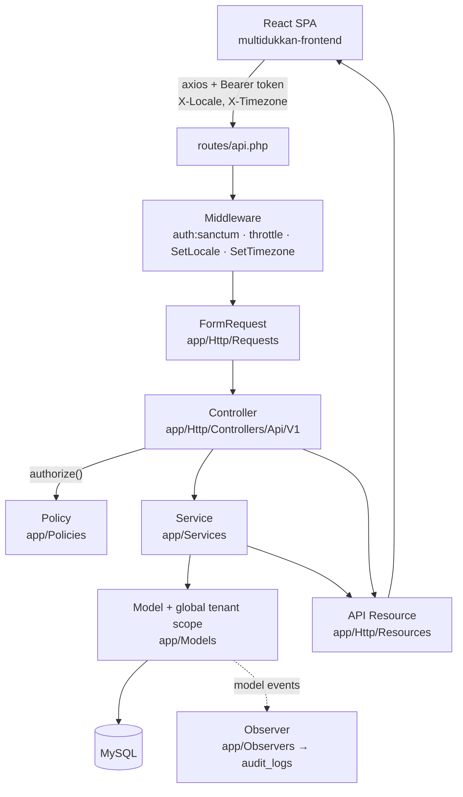
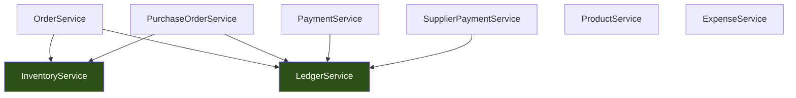
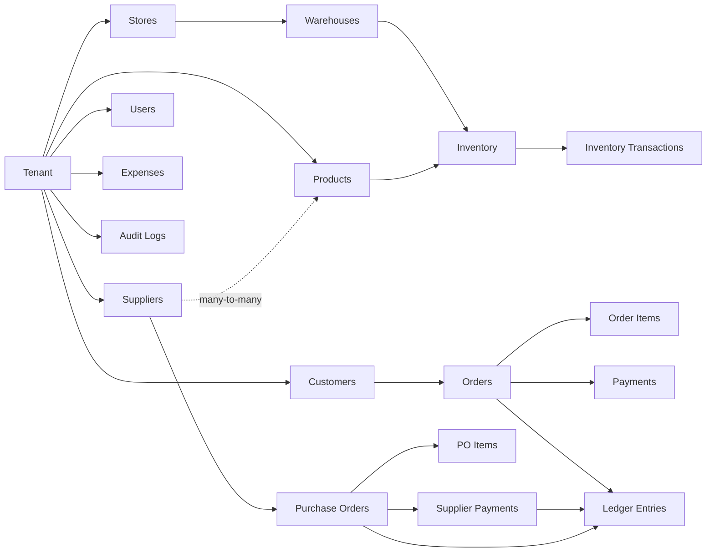
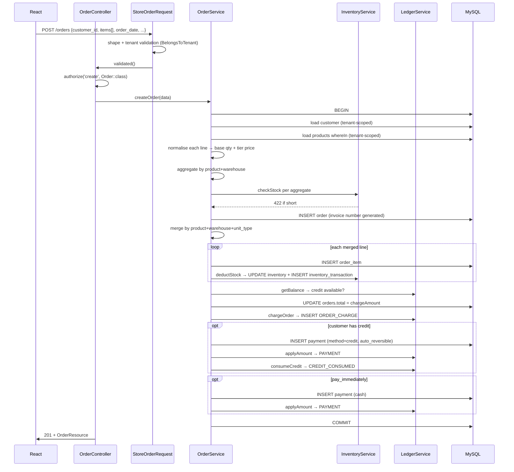
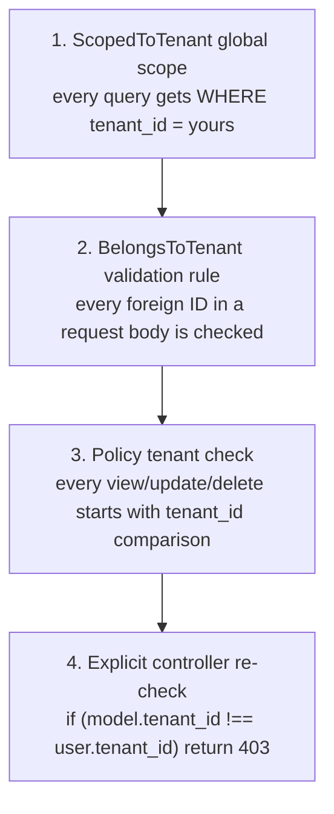

# MultiDukkan — Developer Guide (Start Here)

**Read this first when you are lost.** It explains how the system actually works, not how it was
supposed to work. Everything here was traced through real code in this repository (`app/`,
`routes/`, `database/migrations/`, `tests/`) and the sibling frontend repo
(`../multidukkan-frontend`) on 2026-08-30.

## Honesty labels used throughout

| Label | Meaning |
|---|---|
| ✅ **Confirmed** | The code clearly and unambiguously does this. I read the lines. |
| 🔍 **Inferred** | The code strongly suggests this, but nothing states it outright. |
| ❓ **Unclear** | I could not confidently determine this from the code. |
| ⚠️ **Potential issue** | The implementation looks inconsistent, risky, or contradicts a stated rule. |

Anything not labelled is Confirmed.

**Where this doc sits**: `docs/README.md` indexes the older, topic-scoped docs
(`06-domain/`, `07-business-rules/`, ADRs). Those go *deeper* on individual topics. This guide goes
*wider* — it is the map that tells you which of those to open. If they disagree, check the code and
fix the doc.

---

## Table of contents

1. [What is MultiDukkan?](#1-what-is-multidukkan)
2. [Architecture explained like I'm five](#2-architecture-explained-like-im-five)
3. [System map](#3-system-map)
4. [Domain map](#4-domain-map)
5. [Business flows (traced end to end)](#5-business-flows-traced-end-to-end)
6. [Aggregation vs validation](#6-aggregation-vs-validation)
7. [Important functions, explained properly](#7-important-functions-explained-properly)
8. [Timezone architecture](#8-timezone-architecture)
9. [Audit logs and the activity feed](#9-audit-logs-and-the-activity-feed)
10. [Security](#10-security)
11. [If I need to change X, where do I go?](#11-if-i-need-to-change-x-where-do-i-go)
12. [Testing architecture](#12-testing-architecture)

Sister documents: [DOMAIN_RULES.md](DOMAIN_RULES.md) · [DATABASE_GUIDE.md](DATABASE_GUIDE.md) ·
[FRONTEND_GUIDE.md](FRONTEND_GUIDE.md) · [ARCHITECTURE_DECISIONS.md](ARCHITECTURE_DECISIONS.md) ·
[CODEBASE_NOTES.md](CODEBASE_NOTES.md) · [LEARNING_PATH.md](LEARNING_PATH.md)

---

## 1. What is MultiDukkan?

### The five-year-old version 😂

Imagine a shop. The shop owner needs to remember four things:

1. **What do I have?** (products sitting on shelves in different rooms)
2. **Who bought what?** (sales)
3. **Who still owes me money?** (debts)
4. **Who do I owe money to?** (suppliers)

MultiDukkan is a notebook that never forgets and never does the arithmetic wrong. It is a *shared*
notebook: many different shop owners use the same notebook, but each one can only ever see their own
pages. That "only your own pages" rule is called **multi-tenancy**, and it is the single most
important rule in the whole system.

### The technical version

MultiDukkan is a **multi-tenant SaaS backend** for small Egyptian retail businesses. It is a Laravel
REST API (JSON only, no Blade views) consumed by a separate React SPA. Auth is Laravel Sanctum
personal access tokens. The database is MySQL everywhere, including the test suite.

One **tenant** = one business. A tenant owns **stores**, each store owns **warehouses**, and stock
lives in a warehouse. Users belong to a tenant and (optionally) to one store; a user with
`store_id = null` is a tenant admin who sees everything.

### The four analogies that actually hold

| Concept | Think of it as | Why the analogy holds |
|---|---|---|
| **Tenant** | A separate shop living inside the same building | Every business table carries a `tenant_id`; a global Eloquent scope filters every query by the logged-in user's tenant. ✅ |
| **Order** | A business *event*, not a record | Creating one order writes an order, N order items, N inventory movements, 1–3 ledger entries, and possibly payments — all in one transaction. ✅ |
| **Inventory** | A bank account statement, not a sticky note | `inventory.quantity` is a running total, and `inventory_transactions` is the append-only statement of every movement that produced it. ✅ |
| **Ledger** | The customer's account statement at the shop | `ledger_entries` is append-only history; a balance is *derived* by summing it, never stored on the customer. ✅ |

**Where the analogies break** — worth knowing so you don't over-extend them:

- The ledger is **not** double-entry bookkeeping. There is no "every debit has a matching credit
  account". It is a single-sided event log per customer (or per supplier) and the balance is a
  filtered sum. 🔍
- Inventory is **not** purely event-sourced. `inventory.quantity` is a real, mutable column that is
  incremented/decremented directly; the transaction log is written *alongside* it, not derived from
  it. If the two ever diverge, nothing in the code detects it. ✅ (see
  [CODEBASE_NOTES.md](CODEBASE_NOTES.md))

---

## 2. Architecture explained like I'm five

### The restaurant analogy

```
You (browser)  →  Waiter (Controller)  →  Order slip check (FormRequest)
                                        →  Chef (Service)
                                        →  Pantry (Model / Eloquent)
                                        →  Fridge (Database)
                                        →  Plating (API Resource)  →  back to you
```

- The **waiter** does not cook. He takes your order, checks you're allowed to order, and carries
  plates. If a waiter starts cooking, the kitchen has no idea what food went out.
- The **order slip check** happens before the chef sees anything. Bad slips never reach the kitchen.
- The **chef** owns all the recipes. Two waiters asking for the same dish get the identical dish.
- The **pantry** just holds ingredients and knows what's related to what. It doesn't decide recipes.
- **Plating** decides what the customer actually sees — never the raw ingredients.

### The same thing, technically



### Layer by layer

#### Routes — `routes/api.php`

- **Does**: maps URL + verb → controller method, and attaches middleware.
- **Must NOT contain**: closures with logic, validation, queries.
- **Depends on**: controllers. **Depended on by**: the frontend's URL strings.
- **Why it exists**: one file where you can read the entire public surface of the API in 140 lines.
- Every authenticated route lives inside one `Route::middleware(['auth:sanctum','throttle:api'])`
  group. Only `/login` and `/register` are outside it (throttled 5/min). ✅

#### Middleware — `app/Http/Middleware/`

Only two custom ones exist, both appended to the `api` group in `bootstrap/app.php`:

- `SetLocale` — reads `X-Locale`, validates against `['ar','en']`, defaults to **Arabic**.
- `SetTimezone` — reads `X-Timezone`, validates against `timezone_identifiers_list()`, stashes the
  result on the request. Never changes storage or serialization. See
  [§8](#8-timezone-architecture).

There is **no tenant middleware**. Tenant isolation is done by a model trait, not middleware. ✅

#### FormRequests — `app/Http/Requests/`

- **Does**: shape validation, type/range validation, and cross-tenant existence checks via the
  `BelongsToTenant` rule.
- **Must NOT contain**: business rules that need other services' state, DB writes, or the decision
  of *who* may act (that's the Policy).
- **Why it exists**: so a controller can call `$request->validated()` and trust the array.
- ⚠️ `authorize()` returns `true` in every single FormRequest in this codebase. Authorization is
  done in controllers via `$this->authorize(...)`, never in the request. Consistent, but if you
  expect a FormRequest to gate access, it does not. ✅

#### Controllers — `app/Http/Controllers/Api/V1/`

- **Does**: authorize, call one service (or do trivial CRUD), shape the HTTP response, catch
  `ValidationException` and turn it into a specific status code.
- **Must NOT contain**: money math, stock math, multi-step writes.
- **Reality check**: thin for orders/payments/purchases/products. **Fat** for list endpoints —
  `OrderController::index`, `DashboardController::index`, `ReportController::daily` and
  `AuditLogController::index` all contain substantial query construction and aggregation with no
  service behind them. ✅ That is a real inconsistency, not something you're misreading. See
  [CODEBASE_NOTES.md](CODEBASE_NOTES.md).

#### Services — `app/Services/`

This is where the system actually lives. Eight services:

| Service | Owns | Called by | Calls |
|---|---|---|---|
| `LedgerService` | All money truth: balances, charges, payments applied, credit, refunds | Everything financial | nothing (leaf) |
| `OrderService` | Order lifecycle: create, add/adjust item, update, cancel | `OrderController` | `InventoryService`, `LedgerService` |
| `PaymentService` | Direct payment, auto-payment, FIFO distribution | `PaymentController` | `LedgerService` |
| `InventoryService` | Every mutation of `inventory.quantity` + its transaction log | `OrderService`, `PurchaseOrderService`, `ProductController`, `InventoryController` | nothing (leaf) |
| `PurchaseOrderService` | PO lifecycle + weighted-average costing | `PurchaseOrderController` | `InventoryService`, `LedgerService` |
| `SupplierPaymentService` | Paying suppliers, reversing those payments | `SupplierPaymentController` | `LedgerService` |
| `ProductService` | Product creation + opening stock | `ProductController` | nothing |
| `ExpenseService` | Expense CRUD + period totals for reports | `ExpenseController`, `ReportController` | nothing |

Plus `app/Services/AI/` (Groq via the Prism library) for product descriptions, insights and chat —
isolated, no financial or stock side effects. ✅

**The dependency rule that matters**: services depend *downward* only. `LedgerService` and
`InventoryService` are leaves — they call no other service. This is why they can be trusted as
sources of truth: nothing can inject behaviour underneath them.



#### Models — `app/Models/`

- **Does**: relationships, the tenant global scope, query scopes (`whereUnpaid`, `cashOnly`,
  `creditOnly`), and small derived helpers (`Order::settledAmount()`, `isSettled()`,
  `cashReceived()`).
- **Must NOT contain**: multi-model workflows, HTTP concerns, money aggregation across entities.
- ⚠️ `Product` has a `booted()` hook that deletes its inventory rows on delete, and `Supplier`/
  `Product` both carry `syncProducts` / `syncSuppliers` write helpers. That is business logic sitting
  in a model. It works, but it's the exception to "logic lives in services".

#### Observers — `app/Observers/`

Seven observers, registered in `AppServiceProvider::boot()`. They do exactly two jobs:

1. **Write `audit_logs` rows** on created/updated/deleted.
2. **Veto deletions** via `deleting()` — throwing `ValidationException` to block a delete that would
   destroy or orphan history (see [DOMAIN_RULES.md](DOMAIN_RULES.md) §Deletion).

#### API Resources — `app/Http/Resources/`

- **Does**: turn a model into the exact JSON shape the frontend expects, including derived display
  fields (`status`, `paid`, `amount_remaining`, `profit_margin`).
- ⚠️ Not universally used. `PaymentController::index`, `UserController`, `SearchController`,
  `LedgerEntryController::summary` and `DashboardController`'s `top_debtors` all return
  hand-built arrays or raw models. ✅

#### Policies — `app/Policies/`

Eleven policies, all registered explicitly with `Gate::policy(...)`. Every `view`/`update`/`delete`
method starts with `$user->tenant_id === $model->tenant_id`, then checks the role string. See
[§10](#10-security).

---

## 3. System map

```
multidukkan/                          ← Laravel API (this repo)
├── app/
│   ├── Console/Commands/             VerifyDatabaseEngine — asserts every MySQL table is InnoDB
│   │                                 (no InnoDB → no transactions → all the atomicity guarantees
│   │                                 in this doc are fiction). One command, load-bearing.
│   ├── Http/
│   │   ├── Controllers/Api/V1/       21 controllers. All API, all versioned under V1.
│   │   ├── Middleware/               SetLocale, SetTimezone only.
│   │   ├── Requests/                 33 FormRequests. One per write endpoint.
│   │   └── Resources/                13 API Resources.
│   ├── Models/                       19 models + Concerns/ScopedToTenant.
│   ├── Observers/                    7 observers: audit trail + deletion vetoes.
│   ├── Policies/                     11 policies: tenant check + role check.
│   ├── Providers/                    AppServiceProvider (policies, observers, rate limits),
│   │                                 TelescopeServiceProvider (local only).
│   ├── Rules/                        BelongsToTenant, OrderBelongsToCustomer.
│   ├── Services/                     The business logic. Read this directory first.
│   │   └── AI/                       Groq/Prism integration, isolated.
│   └── Support/LocalDateRange.php    All timezone/calendar conversion. Single point of truth.
├── config/app.php                    timezone=UTC, display_timezone, business_timezone.
├── database/migrations/              55 migrations. Schema history, in order.
├── lang/{ar,en}/                     Arabic is the default UI + API message language.
├── routes/api.php                    The entire public API surface.
└── tests/Feature/                    33 feature test files, 390 tests. No unit tests.
```

### How the parts talk to each other

| From | To | Mechanism |
|---|---|---|
| Frontend → API | HTTP + `Authorization: Bearer`, `X-Locale`, `X-Timezone` | `src/api/axios.js` interceptor |
| Controller → Policy | `$this->authorize('verb', $model)` | Gate, registered in `AppServiceProvider` |
| Controller → Service | Constructor injection | Laravel container |
| Service → Service | Constructor injection, downward only | Laravel container |
| Model write → audit | Eloquent model events | Observers |
| Any query → tenant filter | `ScopedToTenant` global scope | Model trait |

### Things that do **not** exist here (so stop looking for them)

- ❌ No jobs, queues, or events/listeners in `app/`. `QUEUE_CONNECTION=database` is configured but
  nothing dispatches. ✅
- ❌ No repositories, no DTOs, no interfaces for services. Services are concrete classes.
- ❌ No stock-transfer module yet. `InventoryTransaction::TYPE_TRANSFER_IN/OUT` constants exist and
  are unused — Phase 3 groundwork. ✅
- ❌ No `app/Http/Middleware/` tenant guard.
- ❌ No API docs generator / OpenAPI spec.

---

## 4. Domain map



### Tenants

- **Problem solved**: many businesses, one deployment, zero data leakage.
- **Entities**: `tenants`. Every business table has `tenant_id`.
- **Operations**: created only by `POST /register`, which in one transaction creates the tenant,
  9 default Arabic units, the `tenant_admin` user, and a walk-in customer named "زبون نقدي". ✅
  There is no endpoint to update or delete a tenant.
- **Enforced by**: `ScopedToTenant` (global scope + auto-stamp), `BelongsToTenant` validation rule,
  explicit `where('tenant_id', ...)` in controllers, and a tenant check in every policy.
- **Must always be true**: no row can be read or written across tenants. See
  [DOMAIN_RULES.md](DOMAIN_RULES.md).

### Products & units

- **Problem solved**: what the shop sells, at what price, in what unit, at what cost.
- **Entities**: `products`, `units` (a per-tenant list of unit *names* only), `supplier_products`.
- **Operations**: CRUD (`tenant_admin` only), plus an inline `stocks[]` editor on create/update that
  sets per-warehouse quantity and threshold.
- **Key fields**:
  - Six selling prices: `price` (default) + `price_a`…`price_e` (customer tiers).
  - `cost_price` — weighted average, maintained by `PurchaseOrderService` (ADR-008).
  - **Dual units**: `unit` (base), `secondary_unit`, `conversion_factor`. A "box of 12" is
    `unit='pcs'`, `secondary_unit='box'`, `conversion_factor=12`.
  - `opening_quantity` — written once at creation, never touched again.
- **Rule that must hold**: **stock is always stored in base units.** Every service that accepts a
  `unit_type` multiplies by `conversion_factor` before touching inventory. ⚠️ Except
  `OrderService::adjustItem` — see [CODEBASE_NOTES.md](CODEBASE_NOTES.md) #1.

### Supplier ↔ Product

- **Problem solved**: the same product is bought from several suppliers at different prices.
- **Entity**: the `supplier_products` pivot — composite PK `(supplier_id, product_id)`, plus
  `tenant_id`, `cost_price`, `last_purchase_price`, `last_purchased_at`, `is_preferred`, `notes`.
- **Operations**: attach / bulk-attach / update-pivot / detach (`SupplierProductController`), and an
  automatic `syncProducts()` write from `PurchaseOrderService` on every PO.
- **Why not `products.supplier_id`**: a single FK on the product could hold exactly one supplier and
  no per-supplier price. See [DOMAIN_RULES.md](DOMAIN_RULES.md) §Supplier/Product.

### Customers

- **Entities**: `customers` (soft-deleted).
- **Key fields**: `price_tier` (`null`/`default`/`a`–`e`), `is_walk_in`, `code` (`C-001`, generated),
  `area`, `created_by_store_id` (tracking only, not a restriction).
- **Walk-in**: one per tenant, created at registration, excluded from `/customers` and from dashboard
  debt stats. It is the customer the Quick Sale flow bills. ✅
- **Deletion**: blocked by `CustomerObserver::deleting` if the customer has any order (incl.
  soft-deleted), any payment, or a non-zero balance.

### Orders

- **Problem solved**: recording a sale and everything it causes.
- **Entities**: `orders` (soft-deleted), `order_items`.
- **Snapshots** (ADR-005): `orders.customer_name_snapshot`, `order_items.product_name` and
  `unit_price`. An invoice renders from these, never from live product/customer rows.
- **Stored vs derived**:
  - `orders.total` — **stored** (ADR-004). Written at creation, afterwards only via
    `LedgerService::adjustOrderCharge`.
  - `orders.status` — **never stored**. Derived in `OrderResource::resolveStatus()` as
    `settledAmount() >= total ? 'paid' : 'unpaid'`.
  - `orders.order_date` — the *business* calendar date the shop puts on the order. Distinct from
    `created_at`, which is the true UTC creation instant. Backdating changes only `order_date`.
- **Editability rules** (`OrderService::ensureOrderIsEditable`): no payments → anyone; partially paid
  → `tenant_admin`/`store_manager` only; fully settled → nobody.

### Payments & Ledger

Covered in depth in [§5.4](#54-payments) and [DOMAIN_RULES.md](DOMAIN_RULES.md).

Short version: `payments` records the money; `ledger_entries` records the *effect on what is owed*.
A balance is always `getBalance()`, never `total − payments`.

### Inventory & Warehouses

- **Entities**: `warehouses`, `inventory` (singular table name — `$table = 'inventory'` on the
  model), `inventory_transactions`.
- **Shape**: `inventory` is one row per `(warehouse_id, product_id)` with a UNIQUE constraint,
  holding `quantity` and `threshold`.
- **Negative stock is impossible**: `inventory.quantity` is `unsignedInteger`, and `checkStock()`
  rejects deductions that exceed availability with a 422.
- **Every mutation logs**: `deductStock`, `restoreStock`, `adjustStock`, `setStock` all write an
  `inventory_transactions` row. ⚠️ `ProductService::createProduct` is the exception — opening stock
  is written straight to `inventory` with no transaction row. See
  [CODEBASE_NOTES.md](CODEBASE_NOTES.md) #6.

### Purchase Orders

- **Entities**: `purchase_orders` (soft-deleted), `purchase_order_items` (soft-deleted),
  `supplier_payments`.
- **Effects of creating one**: PO + items written, stock **received** (`PURCHASE_IN`), product
  `cost_price` re-averaged, `supplier_products` pivot updated, `PURCHASE_CHARGE` ledger entry posted.
- **No `pay_immediately`** — supplier payments are always a separate call.

### Expenses

- Standalone. Tenant + optional store, category, amount, `expense_date` (a calendar DATE), soft
  deleted. Feeds `net_profit` in the daily report. `store_staff` is blocked from every endpoint.

### Reports, Search, Dashboard, AI

Read-only aggregation endpoints. `ReportController::daily` is the biggest one — it loads orders and
payments for a date range and builds six different breakdowns in PHP (not SQL).

### Roles

Three role strings on `users.role` (ADR-002): `tenant_admin` (`store_id = null`), `store_manager`,
`store_staff`. See [§10](#10-security) for the exact matrix.

---

## 5. Business flows (traced end to end)

### 5.1 Creating an order

**Frontend**: `src/pages/CreateOrder.jsx` → `POST /api/orders`.



**Step by step, with the "why":**

| # | Step | Why it happens here |
|---|---|---|
| 1 | `createOrder` runs `createOrderAttempt` in a loop, up to 3 times | The `(tenant_id, invoice_number)` UNIQUE index can collide under concurrency. A duplicate-key `QueryException` (SQLSTATE 23000 naming that index) is caught and retried with a freshly generated number. Any other `QueryException` re-throws. |
| 2 | `DB::transaction(...)` wraps everything | Order + items + stock + ledger + payments must all commit or all vanish. Selling stock without charging for it, or charging without moving stock, is the failure this prevents. |
| 3 | `$batchId = Str::uuid()` | Groups this order's per-line `inventory_transactions` rows so the activity feed shows *one* "sale" event, not one per product. |
| 4 | Load customer with tenant-scoped `findOrFail` | 404 rather than leaking that another tenant's customer exists. |
| 5 | Load all products in **one** `whereIn` + `keyBy('id')`; `abort_if` on count mismatch → 404 | No queries in loops. The count check catches a product that passed FormRequest validation but isn't loadable. |
| 6 | **Normalisation loop** → `$validatedItems` | Converts every line into the two numbers the rest of the method needs: `stockQty` (always base units) and `unitPrice`. Price resolution: explicit `unit_price` override wins; otherwise the customer's tier price (`price_a`…`price_e`, falling back to `price`), multiplied by `conversion_factor` for a secondary-unit line. |
| 7 | **Aggregate** by `product_id + warehouse_id` → `checkStock` per group | Two lines of the same product from the same shelf each pass individually but can overdraw together. See [§6](#6-aggregation-vs-validation). |
| 8 | `Order::create(...)` — header only, no total yet | The invoice number is generated inside this call. `store_id` is forced to the user's own store if they have one; only a tenant admin may pass `store_id`. |
| 9 | **Merge** by `product_id + warehouse_id + unit_type` → `$mergedItems` | Collapses duplicate lines into one row so the invoice reads "Product A × 5" instead of two lines. `unit_type` is in the key so a "3 boxes" line never merges into a "2 pieces" line — they have different unit prices. |
| 10 | Per merged line: insert `order_item`, `deductStock(...)`, accumulate `$totalAmount` | `$totalAmount` is summed from the *persisted* item (`unit_price × quantity`) so it matches what the invoice will render. |
| 11 | `$balanceBefore = getBalance(...)`; `$creditAvailable = max(0, -$balanceBefore)` | A negative balance means the customer is in credit. Read **before** the charge is posted. |
| 12 | `$discount = max(0, min(discount, totalAmount))`, `$chargeAmount = manual_total ?? (total − discount)` | `manual_total` is a deliberate merchant escape hatch (ADR-004) — the owner overrides the computed number at the till. It is not validated against the item math. |
| 13 | `$order->update(['total' => $chargeAmount])` | The one and only place `orders.total` is written outside `adjustOrderCharge`. |
| 14 | `chargeOrder(...)` → `ORDER_CHARGE` ledger entry | The ledger is what balances are computed from. `orders.total` is a performance cache of this number. |
| 15 | If credit was available: create a `Payment` with `method='credit'`, `is_auto_reversible=true`, then post **both** `PAYMENT` and `CREDIT_CONSUMED` | Two entries because they answer two questions: `PAYMENT` reduces what's owed on this order; `CREDIT_CONSUMED` records that the credit pot shrank. Without the second, `getCreditBalance()` would still show the credit as available. |
| 16 | If `pay_immediately`: create a cash `Payment` for `chargeAmount − applyAmount` and post `PAYMENT` | This is the Quick Sale path. Inside the same transaction, so payment failure rolls back the order. |

**What happens if something fails**: any exception rolls the whole transaction back — no order, no
items, no stock movement, no ledger entry. `checkStock` throws an `HttpResponseException` carrying a
422 with a localized "insufficient stock for {product} in {warehouse}, {available} available"
message. `OrderController::store` catches `ValidationException` and flattens it into a single 422
message string.

**What must succeed or fail together** — all of it. There is no partial order.

### 5.2 Quick Sale

**There is no separate Quick Sale backend flow.** ✅ `src/components/QuickSaleModal.jsx` posts to the
same `POST /api/orders` with two extra fields:

```jsonc
{
  "customer_id": <walk_in_customer_id>,   // from /me
  "pay_immediately": true,
  "payment_method": "cash",
  "items": [ ... ]
}
```

Differences from a normal order, all of which fall out of those fields:

1. The customer is the tenant's walk-in customer (`is_walk_in = true`), so the sale never appears in
   customer debt lists or the dashboard's `total_owed`.
2. `pay_immediately` triggers block 16 above — a cash `Payment` and a `PAYMENT` ledger entry inside
   the same transaction.
3. The order is settled on arrival, so `OrderResource` reports `status: 'paid'` immediately and
   `ensureOrderIsEditable` will refuse any later edit.

Everything else — stock deduction, snapshots, invoice numbering, audit rows — is identical.

### 5.3 Purchasing

**Endpoint**: `POST /api/purchase-orders` → `PurchaseOrderService::createPurchaseOrder`. Same
3-attempt invoice retry + transaction wrapper as orders.

```
Supplier chosen
   ↓
Lines normalised: stockQty (base units), unitPrice (as invoiced),
                  costPerBaseUnit = unitPrice / conversion_factor for secondary lines
   ↓
PurchaseOrder created with total = 0
   ↓
Current stock per product summed across ALL warehouses  →  $stockMap
   ↓
per line:
   INSERT purchase_order_item
   recompute weighted-average cost:
       new_avg = (stock × current_cost + qty × line_cost) / (stock + qty)
   UPDATE products.cost_price
   ensureStockRow(product, warehouse)     ← creates a 0-qty row if this pairing is new
   restoreStock(..., TYPE_PURCHASE_IN)    ← stock goes UP
   ↓
supplier_products pivot updated (last_purchase_price, last_purchased_at)
   ↓
UPDATE purchase_orders.total
   ↓
PURCHASE_CHARGE ledger entry (direction = debit)
```

**Why `ensureStockRow` exists**: `restoreStock`/`deductStock` use `firstOrFail` on purpose — they
must never silently invent an inventory row. But receiving a *new* product into a warehouse for the
first time legitimately needs one. So the caller that has the right to create it does so explicitly.
(Commit `be2c49a` fixed exactly this.)

**Why `$runningStock` / `$runningCost` exist**: two lines in the same PO for the same product must
average against each other, not both against the pre-PO stock level.

**Cost per base unit**: a PO line priced "100 EGP per box of 12" stores `unit_price = 100` on the
invoice but averages `100/12 ≈ 8.33` into `cost_price`. The invoice shows what the supplier charged;
`cost_price` is always per base unit. (Commit `ebf151d`.)

**Cancelling a PO** (`DELETE /purchase-orders/{id}`): blocked by `PurchaseOrderObserver::deleting` if
any supplier payment exists. Otherwise: deduct the received stock (`PURCHASE_OUT`), post
`PURCHASE_REVERSAL` (direction credit) for the full total, soft-delete the PO.
⚠️ **`products.cost_price` is not un-averaged on cancel.** A cancelled PO permanently leaves its
influence on the average cost. This is Confirmed behaviour, not documented anywhere else, and may or
may not be intentional.

**Paying a supplier** (`POST /supplier-payments`, `SupplierPaymentService`):
- With `purchase_order_id` → pay that PO directly, capped at what it still owes.
- Without → FIFO across the supplier's unpaid POs, oldest `created_at` first, capped at total owed.
- Each allocation writes a `SupplierPayment` row + a `SUPPLIER_PAYMENT` ledger entry (direction
  credit).
- Reversing (`DELETE /supplier-payments/{id}`) posts `SUPPLIER_PAYMENT_REVERSAL` (debit) then
  **hard-deletes** the payment row. The ledger keeps both entries, so history is intact.

### 5.4 Payments

Three entry points, one rule: **money is applied oldest-order-first, and leftovers become credit.**

#### `POST /payments` — direct payment (`processDirectPayment`)

```
BEGIN
  Order::lockForUpdate()->findOrFail(order_id)     ← MUST be the first query in the transaction
  totalAlreadyPaid = SUM(amount - refunded_amount) for this order
  if totalAlreadyPaid >= order.total  → 422 "already fully paid"
  remaining     = order.total - totalAlreadyPaid
  appliedAmount = min(payment, remaining)
  excess        = payment - remaining   (>= 0)

  INSERT payment(appliedAmount)   +   PAYMENT ledger entry

  if excess > 0:
      applyFifo(excess) across this customer's OTHER unpaid orders, oldest first
      leftover → CREDIT_APPLY ledger entry ("overpayment credit")
COMMIT
```

The `lockForUpdate()` on the order being first is deliberate and commented in the code: under MySQL
REPEATABLE READ, a plain read first would pin a snapshot, and a request unblocking from another
transaction's lock would then compute against stale payment totals. A locking read always sees the
latest committed row.

#### `POST /payments/auto` — auto payment (`processAutoPayment`)

No order is named. Query the customer's unpaid orders (`Order::whereUnpaid()`, oldest `created_at`
first, `lockForUpdate`), then walk them applying `min(remaining, orderOwed)` to each, writing a
`Payment` + `PAYMENT` entry per allocation. Any leftover after every order is settled becomes a
`CREDIT_APPLY` entry described "Auto-payment excess credit".

#### FIFO in one sentence 😂

*"Your money pays off your oldest unpaid bill first, then the next oldest, and whatever is left the
shop keeps on your account as credit."*

Technically: orders sorted `ORDER BY created_at ASC` (note: **`created_at`, not `order_date`** — a
backdated order does not jump the queue 🔍), each allocated `min(remaining, orderTotal − alreadyPaid)`.

#### Refunds (`POST /customers/{customer}/refund` → `LedgerService::issueRefund`)

Two modes, chosen by which field is present:
- `payment_id_target` — refund from one specific payment. `lockForUpdate`, reject if
  `is_auto_reversible` (store credit is never cash-refundable), reject if amount exceeds
  `amount − refunded_amount`.
- `order_id` — refund across the order. Lock every cash payment, sum the refundable, reject if
  exceeded, then distribute FIFO by payment `id`, incrementing each `refunded_amount`.

Either way a single `REFUND` ledger entry is written. `REFUND` counts as a **debit** — it increases
what the customer owes, because the payment that used to satisfy the charge no longer does.

⚠️ `RefundCustomerRequest::withValidator` re-implements the same availability checks that
`issueRefund` performs. Duplicated logic; the request's version runs first and produces the
user-facing message, the service's version is the actual guard.

#### Adjusting a payment (`PATCH /payments/{payment}` → `LedgerService::adjustPayment`)

One of only two sanctioned in-place ledger edits (ADR-006). Blocked if the payment has any
`refunded_amount`, or if the new amount is at or below what's already refunded. Updates the `PAYMENT`
entry's amount and the payment row inside a transaction.
⚠️ `$otherPaymentsTotal` is computed and never used — known dead code.

### 5.5 Cancelling an order

`DELETE /orders/{order}` → `OrderService::cancelOrder`, inside a transaction:

1. Block if any **cash** payment is not fully refunded (`amount > refunded_amount`). The message
   tells the user to refund first. `OrderObserver::deleting` enforces the same rule again at the
   model layer.
2. For each **credit** payment (`is_auto_reversible = true`), post `restoreCredit` → a `CREDIT_APPLY`
   entry giving the customer their store credit back.
3. Restore stock for every line that has a warehouse, converting secondary units back to base, all
   sharing one `batchId`.
4. Post `REVERSAL` for `order.total − creditPaymentsTotal` — only the non-credit portion, because
   step 2 already neutralised the credit portion.
5. Hard-delete the credit `Payment` rows (their ledger entries remain — this is the documented
   "bookkeeping artifacts" divergence).
6. Soft-delete the order.

**Worked example.** Order 100, customer had 100 credit:

| Entry | Type | Debit | Credit |
|---|---|---|---|
| pre-existing credit | `CREDIT_APPLY` | | 100 |
| order created | `ORDER_CHARGE` | 100 | |
| credit payment | `PAYMENT` | | 100 |
| credit consumed | `CREDIT_CONSUMED` | 100 | |
| **cancel:** credit restored | `CREDIT_APPLY` | | 100 |
| **cancel:** reversal (100 − 100 = 0) | — none — | | |
| **Totals** | | **200** | **300** |

Balance = 200 − 300 = **−100** → the customer has their 100 credit back. Correct. ✅

### 5.6 Inventory

**How stock is represented**: `inventory.quantity` is the current state; `inventory_transactions` is
the history. **The current state is authoritative for reads** — nothing recomputes quantity by
replaying the log. So MultiDukkan is *state-with-an-audit-log*, not event-sourced. 🔍

**Consequences, stated plainly:**
- Reads are fast (one row per product/warehouse) — this is why it was built this way.
- If a bug ever writes `inventory.quantity` without a matching transaction row, nothing detects the
  drift. There is no reconciliation command.
- You cannot ask "what was stock on 3 March?" without replaying the log yourself.

**The five mutation paths, all in `InventoryService`:**

| Method | Direction | Transaction type | Guard |
|---|---|---|---|
| `checkStock` | none (read) | none | 422 if `quantity < requested` |
| `deductStock` | down | `SALE` (or override) | `firstOrFail` on the inventory row |
| `restoreStock` | up | `RETURN` (or override) | `firstOrFail` |
| `adjustStock` | either | `ADJUSTMENT_IN` / `ADJUSTMENT_OUT` | own 422 on over-removal; converts secondary units |
| `setStock` | either | via `adjustStock` | computes the delta from an absolute target |
| `ensureStockRow` | none | none | `firstOrCreate` at quantity 0 |

**Concurrency**: `decrement()`/`increment()` issue atomic `SET quantity = quantity ± n` SQL, so two
concurrent sales cannot lose an update. But `checkStock` and `deductStock` are **separate
statements with no row lock between them** ⚠️ — two simultaneous orders can both pass the check.
The `unsignedInteger` column is the final backstop (the second decrement errors rather than going
negative). See [CODEBASE_NOTES.md](CODEBASE_NOTES.md) #4.

**Null-warehouse branch** (ADR-007): every stock-touching loop is wrapped in `if ($warehouseId)`.
Note that `StoreOrderRequest` and `StoreOrderItemRequest` both mark `warehouse_id` as **required**,
so the null branch is currently unreachable through the API for new orders. It exists for legacy
rows and for the ADR's option to relax that rule later. 🔍

---

## 6. Aggregation vs validation

You will hit `$aggregated = []` in `OrderService::createOrderAttempt` and wonder what it is. These
are **five different concepts** that all get lazily called "validation". They are not the same thing
and they happen in a specific order for a reason.

### The five concepts

| Concept | Question it answers | Where it lives | Failure mode |
|---|---|---|---|
| **Input / schema validation** | "Is this even a well-formed request?" | `StoreOrderRequest::rules()` | 422 with field errors |
| **Existence checks** | "Do these IDs point at real rows I'm allowed to see?" | `exists:` rules + `BelongsToTenant`, re-checked in the service by `whereIn` + count comparison | 422 (request) or 404 (service) |
| **Authorization** | "Is *this user* allowed to do this at all?" | `$this->authorize(...)` → Policy | 403 |
| **Aggregation** | "How much of this product am I really taking off this shelf?" | `OrderService`, `$aggregated` | never fails — it's arithmetic |
| **Business validation** | "Does the shop's state permit this?" (enough stock, order not locked, not already paid) | Services: `checkStock`, `ensureOrderIsEditable`, payment guards | 422 |

### What aggregation actually is

Combining logically-identical lines into one before doing arithmetic on them.

```
Input:                          Aggregated for stock check:
  Product A, warehouse 1, 2      →   Product A, warehouse 1, 5
  Product A, warehouse 1, 3
```

### Why aggregation must happen *before* the stock check

If you check each line independently against 4 units of stock:

```
line 1: need 2, have 4  → OK
line 2: need 3, have 4  → OK      ← still 4, nothing deducted yet
total taken: 5 from a shelf holding 4.   ✗
```

Aggregating first turns that into `need 5, have 4 → 422`. This is exactly what the code comment
says: *"Stock is checked per product+warehouse, not per line: two lines for the same product each
pass on their own but can overdraw the shelf together."* ✅

### Why validation still happens after aggregation

Aggregation only fixes *double-counting*. It does not tell you whether the total is affordable —
`checkStock` still has to run, once per aggregate group.

### The subtlety that trips people up: there are TWO groupings

`createOrderAttempt` builds two different maps from the same lines:

| Map | Key | Used for | Why this key |
|---|---|---|---|
| `$aggregated` | `product_id + warehouse_id` | **stock checking only** | Stock doesn't care what unit you ordered in — it's all base units on one shelf. |
| `$mergedItems` | `product_id + warehouse_id + unit_type` | **row creation + stock deduction** | Two lines with different `unit_type` have different `unit_price`; merging them would corrupt the invoice. |

So "2 boxes + 3 pieces of Product A from warehouse 1" is **one** stock check (for
`2×12 + 3 = 27` base units) but **two** order-item rows. That is correct and deliberate — the
inline comment on line 195 says as much. ✅

### Where each check happens, in execution order

```
1. Middleware        auth:sanctum, throttle, SetLocale, SetTimezone
2. FormRequest       shape + type + range + tenant-ownership of every foreign ID
3. Controller        $this->authorize(...)  → Policy → 403
4. Service           re-load entities tenant-scoped, count-check (404)
5. Service           normalise units + prices
6. Service           AGGREGATE
7. Service           business validation (checkStock) → 422
8. Service           writes, inside DB::transaction
```

Note step 4: the service **re-verifies** what the FormRequest already checked. That is intentional
defence in depth — a service can be called from somewhere without a FormRequest in front of it.

---

## 7. Important functions, explained properly

Only functions that move money, move stock, or enforce isolation. Everything else is plumbing.

---

### `OrderService::createOrderAttempt(array $data): Order`

**One sentence.** Turns a validated cart into a persisted sale: order, items, stock movements, ledger
charge, and any automatic payments — atomically.

**ELI5 😂.** The cashier rings up a sale. In one breath the shop writes the receipt, takes the goods
off the shelf, writes "you owe me X" in the customer's account page, spends any store credit the
customer had, and — if they paid cash right now — writes "paid" too. If *anything* goes wrong at any
point, the whole thing is torn up and it's as if the sale never happened.

**Why it exists.** Six different things must happen together for one business event. Spreading them
across a controller would mean every caller re-implements the ordering and the transaction boundary,
and one of them would eventually get it wrong.

**Inputs.** `$data` from `StoreOrderRequest::validated()`: `customer_id`, `items[]` (each
`product_id`, `warehouse_id`, `quantity`, optional `unit_type`, optional `unit_price`), `order_date`
(required, must not be in the shop's future), optional `store_id` (admin only), `notes`, `discount`,
`manual_total`, `pay_immediately`, `payment_method`.

**Output.** The `Order` with `items` loaded.

**Step-by-step.** See [§5.1](#51-creating-an-order) — the table there is the authoritative walkthrough.

**Side effects.**
- `orders` INSERT + UPDATE (total)
- `order_items` INSERT × N
- `inventory` UPDATE × N, `inventory_transactions` INSERT × N (one `batch_id`)
- `ledger_entries` INSERT: `ORDER_CHARGE`, plus `PAYMENT`+`CREDIT_CONSUMED` if credit applied, plus
  `PAYMENT` if `pay_immediately`
- `payments` INSERT × 0–2
- `audit_logs`: **none for creation** — `OrderObserver::updated` deliberately returns early when
  `wasRecentlyCreated` is true, because the `ORDER_CHARGE` ledger entry already owns that moment.

**Invariants it must preserve.**
- `orders.total` == the `ORDER_CHARGE` entry's amount
- inventory never goes negative
- every stock movement has a matching `inventory_transactions` row
- `tenant_id` on everything written == the acting user's tenant

**Failure behaviour.** Full rollback. `checkStock` → 422. Unknown product → 404. Invoice collision →
retried up to 3 times, then the original `QueryException` propagates (500).

**Related.** Called by `OrderController::store`. Calls `InventoryService::checkStock`/`deductStock`,
`LedgerService::getBalance`/`chargeOrder`/`applyAmount`/`consumeCredit`. Mirror image:
`cancelOrder`.

---

### `LedgerService::getBalance(int $tenantId, int $customerId): float`

**One sentence.** The single sanctioned answer to "how much does this customer owe?".

**ELI5 😂.** Add up everything that made the customer owe more. Subtract everything that made them
owe less. That's the number. Positive = they owe you. Negative = you owe them (they have credit).

**Why it exists.** ADR-003, born from a real production bug: three controllers each computed
`order.total − payments` slightly differently and disagreed on screen. There is now exactly one
formula, in one place.

**The formula.**
```
debits  = SUM(amount) WHERE type IN ('ORDER_CHARGE', 'CREDIT_CONSUMED', 'REFUND')
credits = SUM(amount) WHERE type IN ('PAYMENT', 'CREDIT_APPLY', 'REVERSAL')
balance = round(debits - credits, 2)
```

**Why each type sits where it does:**

| Type | Side | Reasoning |
|---|---|---|
| `ORDER_CHARGE` | debit | The sale created an obligation. |
| `CREDIT_CONSUMED` | debit | Store credit was spent; the credit pot shrinks, so the net effect cancels the matching `PAYMENT`. |
| `REFUND` | debit | Cash went back to the customer, so the payment that satisfied the charge no longer does. |
| `PAYMENT` | credit | Money (or credit) reduced the obligation. |
| `CREDIT_APPLY` | credit | Credit was granted — manually, from an overpayment, or restored on cancel. |
| `REVERSAL` | credit | The charge was undone by a cancellation. |

**Side effects.** None — pure read.

**Related.** `getBalancesForCustomers()` is the **batched** version. Use it in any list or dashboard;
calling `getBalance()` per row is an N+1 that has already shipped once and been fixed (`2abffa7`).
`getCreditBalance()` answers a different question: `CREDIT_APPLY − CREDIT_CONSUMED`, floored at 0.

---

### `LedgerService::issueRefund(array $data): LedgerEntry`

**One sentence.** Gives cash back to a customer, spreading it across the right payment rows and
recording it as a debit.

**ELI5 😂.** The customer wants money back. Find the payments they actually made in cash, take the
refund out of those (oldest first), write down on each how much of it has now been given back, and
add one line to their account page saying "we gave you X back — so you owe us that much again".

**Why it exists.** Refunds touch two things that must agree: the `payments.refunded_amount` counters
(which every "how much is still refundable" calculation reads) and the ledger. Doing them separately
would let them drift.

**Step-by-step.**
1. If `payment_id_target` is set: `lockForUpdate` that payment, reject if `is_auto_reversible` (store
   credit is not cash), reject if the amount exceeds `amount − refunded_amount`, then increment.
2. Else if `order_id` is set: lock all `cashOnly()` payments on the order ordered by `id`, sum the
   refundable from that **same locked set**, reject if exceeded, then distribute FIFO.
3. Else: 422 "select an order or payment".
4. Insert one `REFUND` entry.

**Why `lockForUpdate` matters here.** Two refund requests racing on the same payment would both read
`refunded_amount = 0` and both succeed, refunding twice. The lock forces the second to wait and
re-read.

**Invariants.** `SUM(refunded_amount) <= amount` per payment; credit payments are never cash
refunded.

---

### `InventoryService::deductStock(...)` / `restoreStock(...)`

**One sentence each.** Move stock down / up by an exact base-unit amount and write the movement to
the permanent log.

**ELI5 😂.** Take things off the shelf (or put them back), and *always* write in the notebook what
you took, from where, why, and who you are.

**Why they exist.** So that "the shelf count changed" and "we know why the shelf count changed" can
never come apart. Nothing outside `InventoryService` is allowed to touch `inventory.quantity`.

**Inputs.** `$productId`, `$warehouseId`, `$quantity` (**always base units** — conversion is the
caller's job), `$referenceId`, `$referenceType`, `$userId`, `$batchId`, `$type` override.

**Side effects.** One `UPDATE inventory` (atomic `increment`/`decrement`), one
`INSERT inventory_transactions`.

**Failure behaviour.** `firstOrFail` — a missing `(warehouse, product)` inventory row throws
`ModelNotFoundException` (→ 404). This strictness is deliberate: only `ensureStockRow` may create a
row, and only callers that legitimately introduce a new pairing (PO receiving, the product stocks
editor) call it.

**Invariants.** Base units only. Every call produces exactly one transaction row.

---

### `PurchaseOrderService::createPurchaseOrderAttempt(array $data): PurchaseOrder`

**One sentence.** Receives goods from a supplier: stock in, cost re-averaged, supplier charged.

**ELI5 😂.** The supplier's van arrives. Put the goods on the shelves, work out what your stock is
now worth *on average* (old stock at the old price + new stock at the new price ÷ everything),
remember what this supplier charged, and write "we owe them X" on the supplier's page.

**The weighted-average formula** (ADR-008):
```
new_avg = (current_stock × current_cost + purchased_qty × line_cost_per_base_unit)
          ────────────────────────────────────────────────────────────────────────
                          current_stock + purchased_qty
```
`current_stock` is summed across **all warehouses**, not just the receiving one — cost is a property
of the product, not of a location. ✅

**Side effects.** `purchase_orders` INSERT+UPDATE, `purchase_order_items` INSERT × N,
`products.cost_price` UPDATE × N, `inventory` UPSERT + UPDATE, `inventory_transactions` INSERT × N
(`PURCHASE_IN`, one batch), `supplier_products` pivot UPSERT, `ledger_entries` `PURCHASE_CHARGE`.

**Known behaviour to be aware of** ⚠️: `cost_price` is never rolled back by
`cancelPurchaseOrder`.

---

### `PaymentService::applyFifo(...)`

**One sentence.** Spends an overpayment across the customer's other unpaid orders, oldest first, and
returns whatever is left over.

**ELI5 😂.** They paid too much. Use the extra to clear their oldest unpaid bill, then the next, and
hand back whatever still doesn't fit so the caller can turn it into credit.

**Why the `lockForUpdate()` calls, explained.** This runs *nested inside*
`processDirectPayment`'s transaction, which has already done a plain read. Under MySQL REPEATABLE
READ, that first plain read pins a snapshot for the whole transaction — a subsequent plain `SUM()`
would silently reuse it. A locking read always reads the latest committed data, which is the only
way this sees what the lock unblocks into. This is written out in the code comments and is the
subtlest correctness argument in the codebase.

---

### `ScopedToTenant` (trait, `app/Models/Concerns/`)

**One sentence.** Adds an automatic `WHERE tenant_id = <current user's tenant>` to every query on the
model, and stamps `tenant_id` on every create.

**ELI5 😂.** A pair of glasses that makes every other shop's rows invisible, plus a rubber stamp that
puts your shop's name on anything you write.

**Why it exists.** Commit `7a329b9` ("security: enforce tenant isolation across models"). Before it,
isolation depended entirely on every developer remembering `where('tenant_id', ...)` in every query.

**How it works.**
```php
static::addGlobalScope('tenant', fn ($q) => $q->where(qualified 'tenant_id', currentTenantId()));
static::creating(fn ($m) => $m->tenant_id ??= currentTenantId());
```
`currentTenantId()` is `auth()->user()?->tenant_id`. **If nobody is authenticated it returns null and
the scope no-ops** — which is why it does not break seeders, migrations, or console commands, and why
it is *not* a substitute for the explicit checks. ✅

**Applied to** (15 models): Order, Product, Customer, Supplier, SupplierPayment, Payment,
LedgerEntry, Inventory, InventoryTransaction, Warehouse, Store, PurchaseOrder, Expense, Unit,
AuditLog.
**Not applied to**: `User` ⚠️, `OrderItem`, `PurchaseOrderItem`, `Tenant`.
`OrderItem`/`PurchaseOrderItem` have no `tenant_id` column at all — they inherit isolation from their
parent. `User` has one but does not use the trait: every user query is scoped by hand in
`UserController`.

---

### `OrderService::ensureOrderIsEditable(Order $order): void`

**One sentence.** The tiered lock that decides whether an order's money may still be changed.

**The rule.**

| Order state | Who may edit |
|---|---|
| No payments | anyone with `update` permission |
| Partially paid | `tenant_admin`, `store_manager` only |
| Fully settled | nobody — needs a new invoice |

"Settled" counts **all** payments including store credit (`Order::settledAmount()`); "cash received"
(`cashReceived()`) excludes credit and is used for refundability. Two different questions, two
different methods — don't mix them up.

**Called by**: `adjustItem`, `addItem`, and `updateOrder` **only when `discount` is present** (notes
and `order_date` carry no money implications).

---

## 8. Timezone architecture

### ELI5 😂

The database keeps one universal clock (UTC). The screen shows the user's own clock. And there is a
*third* clock — the shop's clock — that decides which trading day a sale belongs to, so a report
shows the same numbers no matter who opens it or where they are standing.

### The three timezones, and which one to use

| Config key | Default | Question it answers | Use it for |
|---|---|---|---|
| `app.timezone` | `UTC` | "What instant is this, absolutely?" | Storage and serialization. Never change this. |
| `app.display_timezone` | `Africa/Cairo` | "What day is it where the *viewer* is?" | Fallback when `X-Timezone` is missing/invalid |
| `app.business_timezone` | `Africa/Cairo` | "What trading day does this belong to?" | Reports, dashboard periods, invoice year, `order_date` validation, audit-log filters |

Resolved via `LocalDateRange::timezoneFor($request)` (viewer) and
`LocalDateRange::businessTimezone()` (shop). The latter **deliberately ignores the request** — the
code comment explains why: a daily report must show identical figures to a manager in Cairo and an
owner in London.

### The pipeline

```
Browser                 Middleware              Storage              Response
───────                 ──────────              ───────              ────────
Intl…resolvedOptions()  SetTimezone validates   DATETIME(6) in UTC   toIso8601ZuluString('microsecond')
  → X-Timezone header   against PHP's tz list   MySQL session = UTC   e.g. 2026-08-30T12:04:55.123456Z
                        stashes on request                            → JS `new Date()` renders local
```

### The one distinction that causes every timezone bug here

`LocalDateRange` has **two** filter methods, and picking the wrong one is the bug:

| Method | For columns that are… | What it does |
|---|---|---|
| `apply()` | **instants** — `created_at`, `paid_at` | Converts the local calendar day into the pair of UTC instants bounding it, then compares `>=` / `<=` against the raw column (keeps indexes usable) |
| `applyCalendarDate()` | **calendar dates** — `order_date`, `expense_date`, `last_purchased_at` | Compares plain `Y-m-d` strings. **No timezone conversion, ever.** |

**Why.** A DATE column holds a *label*, not a moment. "2026-08-21" is the same square on the calendar
for every viewer on Earth. Converting it would shift it by a day for some of them. The class
docblock states this explicitly and it is the single most important sentence in the file.

Worked example — a viewer in Africa/Cairo (UTC+3) filtering for 2026-08-21:
```
instant column  → BETWEEN 2026-08-20 21:00:00 UTC AND 2026-08-21 20:59:59.999999 UTC
date column     → = '2026-08-21'
```

### What runs on the shop's clock, and why

- **Invoice numbering** (`OrderService::generateInvoiceNumber`): `now(businessTimezone())->year`. A
  sale rung up at 02:30 Cairo on 1 January would otherwise be numbered against the year that had
  already ended in UTC.
- **`order_date` validation**: `before_or_equal:` today in the shop's zone. UTC would reject a
  genuinely-today order for the first three hours of every local morning.
- **Daily report + dashboard period**: bounded by the shop's day; the report even returns
  `business_timezone` in its payload so the print page renders times in the same day the totals
  cover.
- **Audit log date filters**: the shop's calendar, so "show me the 22nd" means the shop's 22nd.
- **`supplier_products.last_purchased_at`**: `LocalDateRange::today(businessTimezone())`.

### Edge cases and remaining gaps

- ⚠️ `PurchaseOrderService::generateInvoiceNumber` filters by `created_at` between the year's UTC
  bounds; `OrderService`'s filters by the `invoice_number` prefix instead. The order version also
  uses `withTrashed()`; the PO version does not. See [CODEBASE_NOTES.md](CODEBASE_NOTES.md) #3.
- ❓ Purchase orders have no `order_date` field at all — they are filtered and reported on
  `created_at`. Whether a merchant needs to backdate a PO is a product question I can't answer from
  the code.
- `payments.paid_at` is `now()` (UTC instant) with no backdating path.
- Tests: `tests/Feature/TimezoneTest.php` covers ~23 cases including new-year invoice rollover,
  after-midnight filtering, and "totals are identical wherever the owner is". This area is unusually
  well covered.

---

## 9. Audit logs and the activity feed

### Two different histories, and the difference matters

| | **Business history** | **Audit history** |
|---|---|---|
| Tables | `ledger_entries`, `inventory_transactions` | `audit_logs` |
| Records | *what happened to money and stock* | *who changed which field, from what to what* |
| Written by | Services, explicitly | Observers, automatically |
| Read for | Balances, stock levels, reports | "Who edited this customer's phone number?" |
| Can the system function without it? | **No** — balances are computed from it | Yes — it is pure forensics |

`GET /audit-log` merges **all three** into one feed with a `source` column (`ledger` / `inventory` /
`audit`). That is why the endpoint is called the activity feed even though only one third of it is
audit logs.

### What generates audit rows

`AuditLog` rows come only from observers, on `created` / `updated` / `deleted`, for:
Customer, Product, Supplier, Store, Expense, Order (**updated only**), PurchaseOrder (**updated
only**).

**Not audited**: Payment, LedgerEntry, Inventory, InventoryTransaction, Warehouse, User, Unit.
🔍 The financial and stock ones don't need it — their own tables *are* the history. Warehouse, User
and Unit look like genuine gaps.

**What's stored**: `tenant_id`, `user_id`, `auditable_type` (FQCN) + `auditable_id` (a polymorphic
`morphs`), `action`, and `changes` — a JSON map of `field => [old, new]` built from
`getChanges()` minus `updated_at`. `created_at` only; **`const UPDATED_AT = null`** — audit rows are
never updated. Immutability is by convention, not enforced by the DB. 🔍

### The `wasRecentlyCreated` trick

`OrderObserver::updated` and `PurchaseOrderObserver::updated` both start with:

```php
if ($order->wasRecentlyCreated) { return; }
```

**Why.** Creating an order is an insert-then-fill flow: `Order::create()` writes the header, then
`OrderService` immediately calls `->update(['total' => ...])`. That second write fires `updated`.
But it's part of the creation moment — already owned by the `ORDER_CHARGE` ledger entry — not a real
edit. `wasRecentlyCreated` stays true on that same instance and is false on a model freshly loaded
for a genuine `PATCH`, so this filters exactly the phantom writes. Covered by
`AuditLogTest::test_creating_an_order_writes_no_updated_audit_entry`.

### Does one business operation create multiple rows?

Yes, and there are two correlation mechanisms:

1. **`batch_id`** (a UUID on `inventory_transactions`) — set by `OrderService::createOrder`,
   `cancelOrder`, `PurchaseOrderService::createPurchaseOrder`, `cancelPurchaseOrder`, and the product
   stocks editor. `AuditLogController::index` groups by `COALESCE(batch_id, id)` so a 5-product sale
   is **one** feed row with `item_count: 5`, expandable via
   `GET /audit-log/inventory-batches/{batchId}`.
2. **`reference_type` + `reference_id`** on both `ledger_entries` and `inventory_transactions` —
   points back at the order/PO/payment that caused it.

⚠️ There is **no `operation_id` spanning all three tables.** You cannot ask "show me every row this
one API call produced". Correlating a sale's ledger entries with its inventory rows means joining on
`reference_id` + `reference_type` and knowing the two tables spell those differently (see below).

⚠️ **`reference_type` is not consistent.** Customer-side ledger entries use plain lowercase strings
(`'order'`, `'payment'`, `'manual'`); supplier-side ones use FQCNs (`App\Models\PurchaseOrder`);
`inventory_transactions` uses FQCNs. `AuditLogController` handles this by only resolving entity names
for `source IN ('audit','inventory')` and skipping ledger rows, with a comment explaining why.

### Microsecond timestamps

`LedgerEntry`, `InventoryTransaction` and `AuditLog` all set
`protected $dateFormat = 'Y-m-d H:i:s.u'`, and their migrations use `datetimes(6)`. Without this,
an order's `ORDER_CHARGE` and its grouped inventory row — written milliseconds apart in one request —
would share a timestamp and sort arbitrarily in the feed. Tested by
`test_same_second_events_still_order_newest_first_via_microsecond_precision`.

### Access

`GET /audit-log` and `GET /audit-log/inventory-batches/{id}` check `role !== 'tenant_admin'` inline
and return 403. No policy, no middleware — the only two endpoints doing role checks this way.

---

## 10. Security

### "Logged in" ≠ "allowed"

This is the distinction the whole security model rests on.

- **Authentication** (`auth:sanctum`) answers *"who are you?"*. A valid Bearer token gets you past
  the middleware. That is all it gets you.
- **Authorization** answers *"may you touch this specific row?"*. It has two independent parts:
  - **Tenant isolation** — is this row even in your business?
  - **Role permission** — does your job title allow this action?

**A logged-in user is still not allowed to read another tenant's product.** Four independent layers
enforce that:



Layer 4 looks redundant after layer 3 — and it is. It is deliberate belt-and-braces (the comment in
`ExpenseController::update` says so). **Do not 'clean it up'.**

### Authentication

Laravel Sanctum personal access tokens (ADR-001). `POST /login` and `POST /register` are throttled
to 5/min; everything else is 120/min per user, and the three AI endpoints are 10/min. Tokens are
long-lived with no configured expiry ❓. Logout deletes the current token only. Guests get a JSON
401 (`redirectGuestsTo` is overridden in `bootstrap/app.php`).

### The role matrix (read straight from the policies)

| Action | tenant_admin | store_manager | store_staff |
|---|---|---|---|
| View products / customers / orders / inventory | ✅ | ✅ | ✅ |
| Create / update / delete **product** | ✅ | ❌ | ❌ |
| Create / update / delete **supplier** | ✅ | ❌ | ❌ |
| Create / update / delete **purchase order** | ✅ | ❌ | ❌ |
| Create / delete **supplier payment** | ✅ | ❌ | ❌ |
| Link products ↔ suppliers | ✅ | ❌ | ❌ |
| Create **store** | ✅ | ❌ | ❌ |
| Create **warehouse** | ✅ | ✅ | ❌ |
| Update / delete **warehouse** | ✅ | own store only | ❌ |
| Adjust **inventory** | ✅ | own store only | ❌ |
| Create **order** | ✅ | ✅ | ✅ |
| Delete (cancel) **order** | ✅ | ✅ | ❌ |
| Edit a **partially-paid** order | ✅ | ✅ | ❌ |
| Create **payment** | ✅ | ✅ | ✅ |
| Update **payment** | ✅ | ❌ | ❌ |
| Create / update **customer** | ✅ | ✅ | ✅ |
| Delete **customer** | ✅ | ❌ | ❌ |
| Add **customer credit** | ✅ | ✅ | ❌ |
| **Expenses** (any) | ✅ | own store, own rows | ❌ |
| **Audit log** | ✅ | ❌ | ❌ |
| Dashboard **financials** | ✅ | ✅ | ❌ (fields omitted from the payload) |
| Create users | store_manager + store_staff | store_staff only | ❌ |

Store-level scoping is separate from role: any user with `store_id` set has `where('store_id', ...)`
applied to orders, payments, warehouses, inventory and the dashboard.

### Mass assignment

Every model declares `$fillable` (no `$guarded = []` anywhere ✅). Services generally build explicit
arrays rather than passing `$request->validated()` through. Exceptions that pass validated data
straight to `update()`: `CustomerController::update`, `SupplierController::update`,
`PurchaseOrderController::update`, `InventoryController::update`, `OrderService::updateOrder`. All are
safe because the corresponding FormRequest whitelists the fields — but note the dependency: **the
FormRequest is the mass-assignment guard in those paths.**

### Input safety

- `$request->validated()` is used everywhere except `ProductController::update` and
  `WarehouseController::update/store`, which read `$request->name` etc. directly ⚠️ (still validated,
  but it bypasses the whitelist the rule set defines).
- `orderBy` from user input is whitelisted (`ExpenseController`) — never interpolated raw.
- `LIKE` search terms are interpolated into the query string but passed through Eloquent's binding,
  so they're parameterised. `%` and `_` in a search term are not escaped 🔍 — a cosmetic issue, not
  an injection one.
- `X-Timezone` is validated against `timezone_identifiers_list()` before it can reach Carbon.
- Telescope is registered only in `local` and its gate returns false for everyone in other
  environments.

### Common failure scenarios worth internalising

| Scenario | What stops it | Where |
|---|---|---|
| Staff POSTs a `product_id` from another tenant | `BelongsToTenant` rule → 422 | `StoreOrderRequest` |
| Staff GETs `/orders/999` belonging to another tenant | Global scope → route-model binding 404, then policy 403 | `ScopedToTenant`, `OrderPolicy::view` |
| Staff tries to cancel an order | `OrderPolicy::delete` → 403 | `OrderController::destroy` |
| Manager adjusts another store's inventory | `InventoryPolicy::adjust` store check → 403 | tested in `RoleTest` |
| Staff reads the tenant's total debt | Dashboard omits the fields entirely for staff | `DashboardController` |
| Someone edits a fully-paid order | `ensureOrderIsEditable` → 422 | `OrderService` |
| Double-refunding a payment | `lockForUpdate` + `refunded_amount` check | `LedgerService::issueRefund` |

---

## 11. If I need to change X, where do I go?

### Add a field to Product

```
1. database/migrations/…_add_<field>_to_products_table.php
2. app/Models/Product.php                   → $fillable (and $casts if typed)
3. app/Http/Requests/StoreProductRequest.php  → rules
4. app/Http/Requests/UpdateProductRequest.php → rules
5. app/Services/ProductService::createProduct → add to the Product::create array
6. app/Http/Controllers/…/ProductController::update → add to the $product->update array
   ⚠️ update() builds its array by hand, field by field. Miss it and the field silently never saves.
7. app/Http/Resources/ProductResource.php   → expose it
8. FRONTEND: src/pages/CreateProduct.jsx, EditProduct.jsx, ProductDetail.jsx, Products.jsx
9. FRONTEND: src/i18n/ar/products.js AND src/i18n/en/products.js  (both, or the UI shows the key)
10. tests/Feature/ProductTest.php
```

### Change order behaviour

Read in this order: `StoreOrderRequest` → `OrderController::store` → **`OrderService`** →
`OrderResource`. 90% of the answer is in `OrderService`. Before touching it, read
[`docs/07-business-rules/order-lifecycle.md`](07-business-rules/order-lifecycle.md) and ADR-004/005.

### Change stock deduction

`app/Services/InventoryService.php` — and nothing else. If you find `inventory.quantity` being
written anywhere outside that file, that is a bug. Callers to check afterwards: `OrderService`
(create/adjust/add/cancel), `PurchaseOrderService` (create/cancel), `ProductController::update`,
`InventoryController::adjust`.

**Do not forget the unit conversion.** Every caller must convert secondary units to base *before*
calling. This is the single most repeated mistake in this codebase.

### Change payment behaviour

`app/Services/PaymentService.php` for applying money; `app/Services/LedgerService.php` for what it
means financially. Changing the **balance formula** means changing `getBalance` **and**
`getBalancesForCustomers` together — they duplicate the same type lists and will drift silently
otherwise. That change needs a new ADR (the AI guide says escalate).

### Add a new business operation

```
FormRequest (validation + BelongsToTenant)
  → Policy method (if a new permission)
  → Controller method (authorize, call service, return Resource)
  → Service method (typed params, DB::transaction if it touches ≥2 of
     {orders, payments, ledger_entries, inventory})
  → API Resource
  → route in routes/api.php
  → Feature test, including a cross-tenant negative that asserts DB state
```

### Add a new API endpoint

`routes/api.php` → controller method → FormRequest (writes) → Resource → policy method if a new
permission → `tests/Feature/` (remember the `/api/` prefix in test URLs).

### Add a new frontend page

`src/pages/NewPage.jsx` → route in `src/App.jsx` (wrap in `<PrivateRoute><Sidebar/><Layout>`) → link
in `src/components/Sidebar.jsx` → `src/i18n/ar/<namespace>.js` **and** `src/i18n/en/<namespace>.js`
→ register the namespace in both `src/i18n/{ar,en}/index.js`.

### Change how a balance is displayed

`LedgerService` for the number, `OrderResource` / `CustomerResource` for the shape, `lib/format.js`
(`formatCurrency`) for the rendering. **Never** compute a balance in a Resource or a component.

### Change validation messages

`lang/ar/messages.php` and `lang/en/messages.php` (backend), `src/i18n/{ar,en}/` (frontend). Arabic
is the default on both sides — don't "translate to English", that's a documented decision.

---

## 12. Testing architecture

### Shape

- **33 feature test files, 390 test methods, in `tests/Feature/` only.**
- **Zero unit tests.** `tests/Unit/` exists and is empty. Everything is exercised through the HTTP
  layer or by calling services with a real DB.
- MySQL (`phpunit.xml` pins `DB_CONNECTION=mysql` and `DB_DATABASE=multidukkan_test`),
  `RefreshDatabase` on every test. The suite runs against the same engine as production, so
  FK constraints, transactions and `STRICT_TRANS_TABLES` are exercised for real.

🔍 The implied philosophy: this is a system whose bugs live in the *interaction* between layers
(a service writing stock but not the ledger), not inside individual functions. Feature tests catch
that class; unit tests wouldn't. It's a defensible choice for this codebase, at the cost of slower
tests and less precise failure messages.

### What is well covered

| Area | File | Notable |
|---|---|---|
| Tenant isolation | `TenantScopeTest` | Global scope, `find()`, joins, deliberate scope-lifting, `creating` stamping |
| Ledger correctness | `LedgerTest`, `BalanceVerificationTest` | Every entry type, balance after partial/multiple payments, "entries cannot be modified" |
| FIFO / credit | `AutoPaymentTest`, `DirectPaymentTest` | Oldest-first distribution, excess→credit, never over-allocating |
| Roles | `RoleTest`, `SupplierProductAuthorizationTest`, `ExpenseTest` | Every role × every guarded action |
| Timezones | `TimezoneTest` (~23 tests) | New-year invoice rollover, after-midnight filtering, viewer-vs-shop |
| Money overflow | `MonetaryOverflowValidationTest` | Column maxima return 422, not 500 |
| Purchasing | `PurchaseOrderMoneyTest` | Secondary-unit conversion, payment reversal, concurrent reversal |
| Pivot semantics | `SupplierProductPivotTest` | Partial updates, `false`/`0`/`null` not treated as omitted |
| Dashboard scoping | `DashboardScopeTest` | Store scoping + staff financial redaction |

### What looks under-tested

⚠️ Based on reading both the tests and the code:

1. **`OrderService::adjustItem` / `addItem`** — no test file targets them directly. `RoleTest`
   exercises the *permission* around partially-paid edits, but the stock/ledger consequences of an
   item edit are untested. This is exactly where [CODEBASE_NOTES.md](CODEBASE_NOTES.md) #1 lives.
2. **Secondary-unit orders** — `PurchaseOrderMoneyTest` covers conversion on the purchase side;
   nothing covers a *sale* in secondary units end-to-end.
3. **Concurrency** — one test (`test_concurrent_reversal_of_the_same_supplier_payment_is_rejected`).
   The `lockForUpdate` reasoning in `PaymentService` is unverified by tests.
4. **Deletion cascades** — no test asserts what happens to `inventory_transactions` when a product or
   warehouse is deleted.
5. **AI endpoints** — only the localized "no data" message is asserted (`LocaleTest`).
6. **Search, Units, Users controllers** — no dedicated tests.

### "If I change X, which tests do I run?"

| You changed | Run |
|---|---|
| `InventoryService` | `InventoryTest`, `ProductTest`, `PurchaseOrderMoneyTest`, `AuditLogTest` |
| `LedgerService` | `LedgerTest`, `BalanceVerificationTest`, `OrderMoneyTest`, `DirectPaymentTest`, `AutoPaymentTest`, `ReportTest` |
| `OrderService` | `LedgerTest`, `OrderMoneyTest`, `InventoryTest`, `RoleTest`, `AuditLogTest`, `PriceTierTest` |
| `PaymentService` | `DirectPaymentTest`, `AutoPaymentTest`, `PaymentTest`, `BalanceVerificationTest` |
| `PurchaseOrderService` | `PurchaseOrderMoneyTest`, `SupplierProductPivotTest` |
| A policy | `RoleTest`, `ExpenseTest`, `SupplierProductAuthorizationTest` |
| `ScopedToTenant` or any model | `TenantScopeTest` first, then everything |
| `LocalDateRange` or anything with a date | `TimezoneTest`, `ReportTest`, `PaymentTest` |

Run everything: `php artisan test`. The full suite takes under a minute against MySQL — long enough
that a subset is worth it during a tight edit loop, short enough that there is no excuse for not
running it before you call a change done.

### House rules for writing tests here

From `CLAUDE.md` and visible throughout the suite:
- `RefreshDatabase` always; typed properties declared in `setUp()`.
- Never hardcode IDs — use factories.
- Always the `/api/` prefix in route calls.
- Single-resource assertions wrap in a `data` key.
- **Negative tests must assert DB state too** — a 403 that still wrote the row is a passing test and
  a shipped bug.
- Balance assertions go through `LedgerService`, never through hand-computed arithmetic.

---

**Related documents**: [DOMAIN_RULES.md](DOMAIN_RULES.md), [DATABASE_GUIDE.md](DATABASE_GUIDE.md),
[FRONTEND_GUIDE.md](FRONTEND_GUIDE.md), [ARCHITECTURE_DECISIONS.md](ARCHITECTURE_DECISIONS.md),
[CODEBASE_NOTES.md](CODEBASE_NOTES.md), [LEARNING_PATH.md](LEARNING_PATH.md), and the topic-scoped
docs indexed in [README.md](README.md).
**Future improvements**: add the missing `operation_id` correlation across the three history tables;
document PO backdating once a decision exists.
**Open questions**: does a purchase order need its own business date, the way an order has
`order_date`?
**Last review checklist**: [ ] flows still match the services, [ ] role matrix matches the policies,
[ ] labels still accurate. Last reviewed: 2026-08-30.
