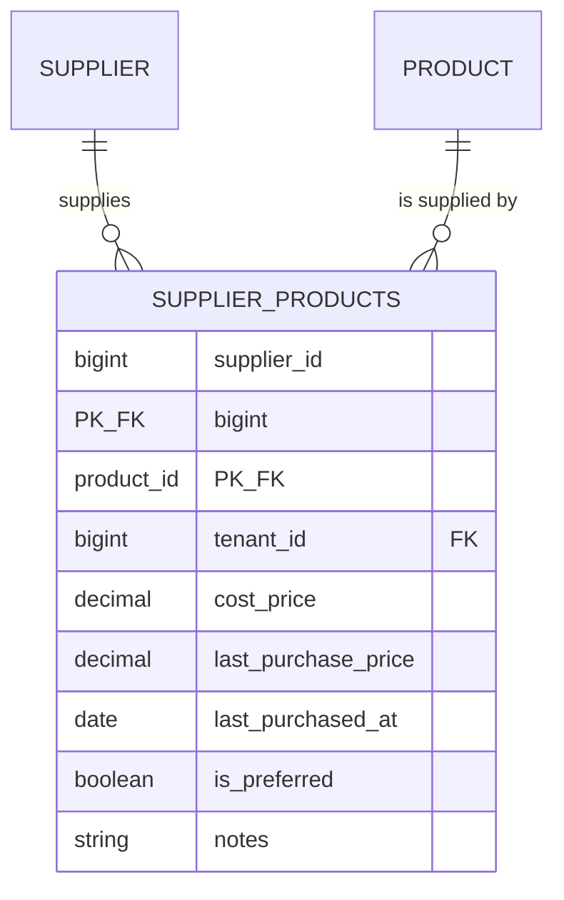
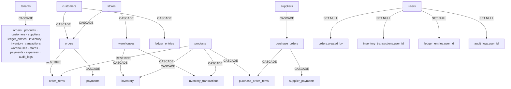

# MultiDukkan — Domain Rules & Invariants

**Invariants are things that must be true before an operation and still true after it.** If one of
these breaks, the system is lying to the merchant about their money or their stock. Everything here
was verified against the code on 2026-08-30.

Labels: ✅ Confirmed · 🔍 Inferred · ❓ Unclear · ⚠️ Potential issue.
Start at [DEVELOPER_GUIDE.md](DEVELOPER_GUIDE.md) if you don't know the system yet.

---

## 1. Tenant isolation

### The rule

> Every tenant-owned row is readable and writable **only** by users of that tenant. There is no
> exception, no admin override, no shared row.

### "Authenticated" vs "allowed"

- **Authenticated** = you presented a valid Sanctum token. The middleware knows *who* you are.
- **Allowed** = the row you're reaching for belongs to your tenant, *and* your role permits the
  action.

A valid token is necessary and nowhere near sufficient. A `store_staff` from Tenant A with a
perfectly valid token has zero access to any row in Tenant B — and the system does not rely on any
single mechanism to make that true.

### How it is enforced — four independent layers

#### Layer 1 — `tenant_id` on every business table ✅

Every business table has `tenant_id` as the first FK. The exceptions, and why:

| Table | Why no `tenant_id` |
|---|---|
| `order_items` | Isolated via `order_id` → `orders.tenant_id` |
| `purchase_order_items` | Isolated via `purchase_order_id` |
| `tenants` | It *is* the tenant |
| `personal_access_tokens`, `sessions`, `cache`, `jobs` | Framework tables |

Everything else — including `units`, `supplier_payments` and `supplier_products` — carries
`tenant_id` directly. ✅

#### Layer 2 — the `ScopedToTenant` global scope ✅

`app/Models/Concerns/ScopedToTenant.php` does two things on every model that uses it:

```php
static::addGlobalScope('tenant', … where('tenant_id', auth()->user()?->tenant_id) …);
static::creating(fn ($m) => $m->tenant_id ??= auth()->user()?->tenant_id);
```

**Applied to**: Order, Product, Customer, Supplier, Payment, LedgerEntry, Inventory,
InventoryTransaction, Warehouse, Store, PurchaseOrder, Expense, AuditLog.

**Critical caveat**: `currentTenantId()` returns `auth()->user()?->tenant_id`. **With no
authenticated user, the scope silently does nothing.** That is why seeders, migrations and console
commands still work — and why the global scope is a safety net, never the plan.

⚠️ **`User` does not use this trait.** `UserController` scopes manually. Any new code touching users
must add `where('tenant_id', ...)` itself.

⚠️ **The AI collaboration guide is out of date on this point.** Line 18 of
[`09-ai-collaboration/ai-collaboration-guide.md`](09-ai-collaboration/ai-collaboration-guide.md)
says *"There is no global scope saving you."* There is now (commit `7a329b9`). The advice that
follows — scope explicitly anyway — remains correct; the premise does not.

#### Layer 3 — the `BelongsToTenant` validation rule ✅

Any foreign ID arriving in a request body is checked, not trusted:

```php
'customer_id' => ['required', 'exists:customers,id', new BelongsToTenant(Customer::class, $tenantId)],
```

Used in: `StoreOrderRequest`, `StoreOrderItemRequest`, `StorePurchaseOrderRequest`,
`StoreProductRequest`, `UpdateProductRequest`, `StoreInventoryRequest`, `AutoPaymentRequest` and
others. Failure is a 422, so the caller can't distinguish "doesn't exist" from "isn't yours".

#### Layer 4 — policies + explicit controller re-checks ✅

Every policy `view`/`update`/`delete` opens with `$user->tenant_id === $model->tenant_id`. Then most
controllers *repeat* the check:

```php
$this->authorize('view', $order);
if ($order->tenant_id != auth()->user()->tenant_id) {
    return response()->json(['message' => __('messages.unauthorized')], 403);
}
```

This is redundant **on purpose** (`ExpenseController` calls it "belt-and-suspenders"). Leave it.

### Invariants

1. No query returns a row from another tenant. Tested: `TenantScopeTest` (7 tests, incl. joins).
2. Every insert carries the acting user's `tenant_id` — auto-stamped, and never overwritten if
   explicitly set (`test_an_explicit_tenant_id_is_never_overwritten`).
3. Every foreign ID in a request body is verified against the tenant before the service sees it.
4. Cross-tenant access fails **closed**: 422 at validation, 404 at lookup, 403 at authorization.
   Never a partial write.

### Store-level scoping — a *different* rule

Do not confuse it with tenant isolation. A user with `store_id` set gets `where('store_id', ...)`
applied to orders, payments, warehouses, inventory and dashboard stats. `tenant_admin` has
`store_id = null` and skips it. This is a *visibility* rule inside one tenant, not an isolation
boundary — and it is applied ad hoc in controllers, not by a global scope. 🔍

---

## 2. Ledger rules

### The rule

> `ledger_entries` is append-only history. Balances are derived from it and stored nowhere else.

### Why financial history must not be edited or deleted

1. **A balance you can't reconstruct is a balance you can't defend.** When a customer disputes what
   they owe, the answer must be a list of events, not a number.
2. **Deleting a row silently changes every past balance.** There is no "as of" query — every balance
   is a sum over all history. Removing an entry rewrites the past.
3. **Corrections are themselves business events.** "We reversed the charge" is information. Deleting
   the charge destroys it.
4. **It already went wrong once.** ADR-003 exists because three controllers computed
   `total − payments` differently and disagreed on screen. Single-source-of-truth is the fix.

### The two sanctioned in-place edits (ADR-006)

Append-only has exactly two documented exceptions, both in `LedgerService`:

| Method | Edits | Guard | Rationale |
|---|---|---|---|
| `adjustPayment(Payment, float, string)` | the `PAYMENT` entry's `amount` | blocked if `refunded_amount > 0`, or if the new amount ≤ already-refunded | Cashier typed the wrong number. A reversal pair would pollute the statement for what was a typo. |
| `adjustOrderCharge(Order, float)` | the `ORDER_CHARGE` entry's `amount` **and** `orders.total` | none — callers gate via `ensureOrderIsEditable` | Item/discount changes must keep the ledger and `orders.total` in lockstep (ADR-004). |

**Everything else appends.** Corrections are new rows: `REVERSAL`, `REFUND`, `CREDIT_APPLY`,
`SUPPLIER_PAYMENT_REVERSAL`, `PURCHASE_REVERSAL`.

⚠️ Enforcement is by convention only. There is no DB trigger, no model `updating` guard, nothing
stopping `LedgerEntry::where(...)->delete()`. The test
`LedgerTest::test_ledger_entries_cannot_be_modified` asserts the *API* offers no such endpoint — it
does not prove the invariant at the model layer.

### The entry types, and which side each falls on

| Type | Side in `getBalance` | Written by |
|---|---|---|
| `ORDER_CHARGE` | debit | `OrderService::createOrder` |
| `CREDIT_CONSUMED` | debit | `OrderService::createOrder` when credit is spent |
| `REFUND` | debit | `LedgerService::issueRefund` |
| `PAYMENT` | credit | `OrderService`, `PaymentService` (direct, auto, FIFO) |
| `CREDIT_APPLY` | credit | overpayment leftover, manual credit, credit restored on cancel |
| `REVERSAL` | credit | `OrderService::cancelOrder` |
| `PURCHASE_CHARGE` | supplier debit | `PurchaseOrderService::createPurchaseOrder` |
| `PURCHASE_REVERSAL` | supplier credit | `PurchaseOrderService::cancelPurchaseOrder` |
| `SUPPLIER_PAYMENT` | supplier credit | `SupplierPaymentService` |
| `SUPPLIER_PAYMENT_REVERSAL` | supplier debit | `SupplierPaymentService::reversePayment` |

⚠️ **`LedgerEntry::TYPES` is stale dead code.** The const lists 8 types, missing `REFUND` and
`SUPPLIER_PAYMENT_REVERSAL`. It is referenced nowhere in `app/` or `tests/`. The DB enum (widened by
two later migrations) is the real list.

### Two schemas in one table

`ledger_entries` holds two generations of design side by side ✅:

| | Customer entries | Supplier entries |
|---|---|---|
| Owner column | `customer_id` | `supplier_id` + `entity_type='supplier'` + `entity_id` |
| Direction | implied by `type` | explicit `direction` enum (`debit`/`credit`) |
| Balance query | `whereIn('type', [...])` | `where('direction', ...)` |
| `reference_type` | `'order'`, `'payment'`, `'manual'` | `App\Models\PurchaseOrder`, `'supplier_payment'` |

This is a **documented divergence**, not a bug. Unification is a planned migration. Do not
"harmonize" it casually, and never mix the idioms in new code — pick the one matching the entity
you're writing for.

### Invariants

1. `orders.total` == the amount on that order's `ORDER_CHARGE` entry, always.
2. `getBalance()` and `getBalancesForCustomers()` must return the same number for the same customer.
   ⚠️ They duplicate the type lists in two places and will drift silently if only one is edited.
3. A customer's balance is never stored on `customers`.
4. `getCreditBalance()` = `CREDIT_APPLY − CREDIT_CONSUMED`, floored at 0.
5. `SUM(refunded_amount) <= amount` on every payment.
6. Credit payments (`is_auto_reversible = true`) are never cash-refundable.

---

## 3. Inventory rules

### The rule

> `inventory.quantity` may only be changed inside `InventoryService`, and every change writes an
> `inventory_transactions` row.

### Why stock history must survive

1. **Shrinkage investigation.** "We're 12 units short" is only answerable if every movement is
   recorded with who, when, and why.
2. **The current quantity is a claim; the log is the evidence.** If they ever disagree, the log is
   what lets you find out which is wrong.
3. **Stock movements have financial consequences.** A sale's stock deduction and its ledger charge
   describe the same event. Losing one leaves the other unexplained.

### Movement types

`SALE`, `RETURN`, `PURCHASE_IN`, `PURCHASE_OUT`, `ADJUSTMENT_IN`, `ADJUSTMENT_OUT`, and
`TRANSFER_IN`/`TRANSFER_OUT` (constants exist, unused — Phase 3 groundwork). ✅

**A note on the AI guide's "PO receipts logged as RETURN" divergence**: that is **no longer true**.
`PurchaseOrderService` now passes `InventoryTransaction::TYPE_PURCHASE_IN` and `TYPE_PURCHASE_OUT`
explicitly. `RETURN` remains the *default* of `restoreStock()`, which is what the note was about.
That row in the divergence table should be updated.

### Invariants

1. `inventory.quantity >= 0` — enforced by `unsignedInteger` at the DB level, and by `checkStock`
   / `adjustStock`'s own guard at the application level.
2. One `inventory` row per `(warehouse_id, product_id)` — UNIQUE constraint.
3. **Stock is stored in base units, always.** Every caller converts by `conversion_factor` before
   calling `InventoryService`.
   ⚠️ **Broken in `OrderService::adjustItem`** — see [CODEBASE_NOTES.md](CODEBASE_NOTES.md) #1.
4. Every quantity change has a matching transaction row.
   ⚠️ **Broken in `ProductService::createProduct`** — opening stock writes `inventory` directly.
   See [CODEBASE_NOTES.md](CODEBASE_NOTES.md) #6.
5. `deductStock`/`restoreStock` never create an inventory row (`firstOrFail`). Only `ensureStockRow`
   and `setStock` may.

---

## 4. Stored vs calculated values

The rule of thumb here: **store what is expensive to derive and stable; derive what must never
drift.**

| Value | Stored? | Where it lives / is computed | Why |
|---|---|---|---|
| `orders.total` | **Stored** | Written at creation; after that only `LedgerService::adjustOrderCharge` | ADR-004. Every list, report and unpaid query needs it; recomputing `SUM(unit_price × quantity)` everywhere fought the #1 requirement (speed). Also `manual_total` can't be derived at all. |
| Order **status** | **Derived** | `OrderResource::resolveStatus()` from `settledAmount() >= total` | A stored status is a cache of two other numbers and will disagree with them the first time a payment is refunded. |
| Customer **balance** | **Derived** | `LedgerService::getBalance()` | ADR-003. |
| Customer **credit** | **Derived** | `LedgerService::getCreditBalance()` | Same. |
| `products.cost_price` | **Stored** | `PurchaseOrderService`, weighted average | ADR-008. Cannot be derived without lot tracking. |
| `payments.refunded_amount` | **Stored** | Incremented by `issueRefund` | A running counter that every refundability check reads. |
| Order `subtotal` | **Derived** | `OrderResource` sums the items | Display only; may differ from `total` when `manual_total` was used. |
| `amount_remaining` | **Derived** | `OrderResource`: `max(0, total − settledAmount())` | |
| Product `profit_margin` | **Derived** | `ProductResource`: `price − cost_price` per tier | |
| `orders.customer_name_snapshot`, `order_items.product_name`/`unit_price` | **Stored (snapshot)** | Written once at sale time | ADR-005. |

### What prevents duplicated sources of truth

- **The write funnel**: `orders.total` has exactly two writers, and one of them (`adjustOrderCharge`)
  updates the ledger in the same call.
- **The ledger rule**: any balance question goes through `LedgerService`. A controller computing
  `total − payments` is the founding sin of this codebase and is called out by name in ADR-003.
- **Snapshots don't re-join**: an invoice renders `order_items.product_name`, never
  `$item->product->name`. Editing a product must not change last March's invoice.

⚠️ **`manual_total` does not survive an item edit.** `recalculateTotal()` recomputes from
`SUM(unit_price × quantity) − discount`, so the override is lost the moment anyone adjusts an item.
Confirmed and tested (`test_manual_total_does_not_survive_a_later_item_edit`) — surprising, but
intentional.

---

## 5. Payment rules (FIFO)

### ELI5 😂

Money pays your oldest unpaid bill first. Then the next oldest. Whatever's left over, the shop keeps
on your account as credit for next time.

### Technically

Three code paths implement the same policy:

| Path | Trigger | Order source |
|---|---|---|
| `processAutoPayment` | `POST /payments/auto` (no order named) | `Order::whereUnpaid()->orderBy('created_at','asc')->lockForUpdate()` |
| `applyFifo` | overpayment on `POST /payments` | same, excluding the order just paid |
| `issueRefund` (order mode) | `POST /customers/{id}/refund` with `order_id` | `Payment::cashOnly()->orderBy('id','asc')->lockForUpdate()` |

Per order: `applyAmount = min(remaining, orderTotal − alreadyPaid)`. Each allocation writes a
`Payment` row **and** a `PAYMENT` ledger entry. Leftover after all orders → `CREDIT_APPLY`.

`whereUnpaid()` is a raw-SQL scope on `Order`:
```sql
total > (SELECT COALESCE(SUM(amount - COALESCE(refunded_amount,0)),0)
         FROM payments WHERE payments.order_id = orders.id)
```

**Two things worth noticing:**
- 🔍 FIFO orders by **`created_at`**, not `order_date`. A backdated order does not jump the queue.
- ✅ `whereUnpaid()` counts *all* payments including store credit; the order list's "unpaid amount"
  statistic in `OrderController::index` uses `cashOnly()`. Those are two different definitions of
  unpaid, in the same feature. See [CODEBASE_NOTES.md](CODEBASE_NOTES.md) #8.

### Supplier payments follow the same policy, different code

`SupplierPaymentService::processSupplierPayment` — direct-to-PO if `purchase_order_id` is given,
otherwise FIFO across `PurchaseOrder::whereUnpaid()` oldest first. It caps the payment at what's
owed and rejects overpayment outright (no supplier credit concept). ⚠️ It uses **no
`lockForUpdate`**, unlike the customer side.

---

## 6. Supplier ↔ Product rules

### The relationship is many-to-many ✅



Composite primary key `(supplier_id, product_id)`, with `(tenant_id, supplier_id)` and
`(tenant_id, product_id)` indexes.

### Why `products.supplier_id` would be wrong

1. **A shop buys sugar from three wholesalers.** One FK holds one of them. You'd lose the other two,
   or duplicate the product row three times and break every "how much sugar do I have" query.
2. **Price is a property of the pair, not of either side.** Supplier A charges 100, Supplier B
   charges 95, for the same product. That number has nowhere to live on `products` and nowhere to
   live on `suppliers`. It belongs on the link.
3. **"Preferred supplier" is a property of the link too.** `is_preferred` answers "who do I usually
   buy this from", which is meaningless on either table alone.
4. **History would be lost on change.** Switching `products.supplier_id` overwrites the previous
   supplier. The pivot keeps every relationship that has ever mattered.

### The pivot fields

| Field | Meaning | Written by |
|---|---|---|
| `cost_price` | What this supplier quotes for this product | Manual — `SupplierProductController` |
| `last_purchase_price` | Actual cost **per base unit** on the most recent PO | Automatic — `PurchaseOrderService` via `Supplier::syncProducts()` |
| `last_purchased_at` | Shop-calendar date of that PO | Automatic (`LocalDateRange::today(businessTimezone())`) |
| `is_preferred` | Default supplier for this product | Manual |
| `notes` | Free text | Manual |
| `tenant_id` | Denormalised for indexing and isolation | Always forced server-side |

**Note the difference between `cost_price` (pivot) and `products.cost_price`:** the pivot one is a
per-supplier quote; the product one is the weighted-average of what you've actually paid, across all
suppliers. Different questions.

### Two sync helpers, two different behaviours ⚠️

| Method | Behaviour |
|---|---|
| `Supplier::syncProducts(array $pivotData)` | `syncWithoutDetaching` — **additive only**, never removes links. Correct for a PO, which shouldn't unlink anything. |
| `Product::syncSuppliers(array $supplierIds)` | `syncWithoutDetaching` **then explicitly detaches** anything not in the list — a true "make membership match this set". |

Both force `tenant_id` from the model, so a client-supplied `tenant_id` is ignored. Tested:
`SupplierProductPivotTest::test_attach_ignores_a_client_supplied_tenant_id`.

### Invariants

1. A supplier and a product on the same pivot row are always in the same tenant. Enforced in
   `SupplierProductController` (`abort_if` on both sides) and by `BelongsToTenant` in the requests.
2. Only `tenant_admin` may create or change links (`ProductPolicy::update` gates every method).
3. Partial pivot updates preserve untouched fields — `false` and `0` are real values, not "omitted".
   Heavily tested in `SupplierProductPivotTest`.

---

## 7. Deletion & data lifecycle rules

**This is the most consequential section in this document.** MultiDukkan's value is that it remembers
what happened. Deletion is the one operation that can destroy that.

### The governing principle

> A historical business event is not owned by the entity it references. When a product stops being
> sold, the record that it *was* sold does not stop being true.

### Per-entity lifecycle

| Entity | Hard or soft? | Deletion guarded by | What must never disappear |
|---|---|---|---|
| **Order** | Soft (`deleted_at`) | `OrderObserver::deleting` + `cancelOrder`: blocked while unrefunded cash payments exist | Ledger entries (`ORDER_CHARGE`, `REVERSAL`), inventory movements |
| **Purchase order** | Soft | `PurchaseOrderObserver::deleting`: blocked if any supplier payment exists | `PURCHASE_CHARGE`/`PURCHASE_REVERSAL`, stock movements |
| **Customer** | Soft | `CustomerObserver::deleting`: blocked if any order (incl. trashed), any payment, or non-zero balance | Their entire ledger |
| **Supplier** | Soft | `SupplierObserver::deleting`: blocked if any PO (incl. trashed) | Supplier ledger |
| **Expense** | Soft | none | — |
| **Purchase order item** | Soft | — | — |
| **Store** | **Hard** | `StoreObserver::deleting`: blocked if it's the last store, has warehouses, or has unpaid orders | ⚠️ see below |
| **Product** | **Hard** | `ProductObserver::deleting`: blocked if it has order items, PO items (incl. trashed), or stock > 0 | ⚠️ see below |
| **Warehouse** | **Hard** | `WarehouseController::destroy`: blocked if `quantity > 0` | ⚠️ see below |
| **User** | **Hard** | `UserController::destroy`: can't delete self; role rules | Orders keep `created_by` via `nullOnDelete`; expenses keep `created_by_name` snapshot |
| **Payment** | Hard, narrow | Only credit payments, only inside `cancelOrder`, only after their ledger effect is reversed | Their ledger entries remain |
| **Supplier payment** | Hard | Only via `reversePayment`, after posting `SUPPLIER_PAYMENT_REVERSAL` | The two ledger entries remain |
| **Ledger entry** | **Never** | — | Everything |
| **Inventory transaction** | **Never** (by application code) | — | Everything |
| **Audit log** | **Never** | — | Everything |

### The foreign-key map



### Where CASCADE is right, and where it isn't

**Right:**
- `users → …user_id` uses **SET NULL** everywhere. Correct: a departed employee should not erase the
  orders they rang up. `expenses.created_by_name` even snapshots the name so it survives.
- `orders/products → order_items` uses **RESTRICT**. Correct and strong: the database itself refuses
  to let a product with sales history be deleted, independent of any observer.
- `purchase_orders → purchase_order_items` CASCADE is acceptable — POs are soft-deleted, so the
  cascade only fires on a force-delete.

**⚠️ Genuinely dangerous, ranked:**

#### 🔴 1. Hard-deleting a **product** erases its stock history

`inventory_transactions.product_id` is `cascadeOnDelete`, and `Product` has **no** `SoftDeletes`
trait. `ProductObserver::deleting` blocks products with order items, PO items, or stock > 0 — but a
product that only ever saw manual adjustments and now sits at zero **can** be deleted, and every
`ADJUSTMENT_IN`/`ADJUSTMENT_OUT` row for it vanishes without trace.

`Product::booted()` also explicitly does `$product->inventories()->delete()` on deleting, so the
inventory rows go too.

**Recommendation** (based on the actual relationships, not a general preference): products should be
soft-deleted / archived rather than hard-deleted. A merchant who "removes" a product almost always
means "stop showing it to me", not "delete the fact that it existed". If soft deletes are added,
`products.sku`'s `unique(['tenant_id','sku'])` will need attention — a trashed product still occupies
its SKU.

#### 🔴 2. Hard-deleting a **warehouse** erases its stock history

`inventory_transactions.warehouse_id` is `cascadeOnDelete`, and `Warehouse` has no `SoftDeletes`.
`WarehouseController::destroy` only blocks when `quantity > 0`. So a warehouse that has been emptied
— which is precisely the state a warehouse is in when you're about to close it — deletes cleanly and
takes every movement that ever passed through it.

**Recommendation**: `inventory_transactions.warehouse_id` should be `RESTRICT` (or the warehouse
should be soft-deleted), because the movement record is about a past event, not about the warehouse's
current existence.

#### 🟠 3. Hard-deleting a **tenant** cascades away all financial history

`tenants → ledger_entries` is CASCADE. There is no tenant-deletion endpoint, so this is only
reachable by a direct DB operation or a future account-closure feature. Worth knowing before that
feature gets built.

#### 🟠 4. `customers → ledger_entries` CASCADE

`CustomerObserver::deleting` blocks deletion when any order, payment, or balance exists, and
customers are soft-deleted, so in practice this never fires. But `forceDelete()` would erase the
customer's entire financial history with no guard in front of it.

#### 🟢 5. `withTrashed()` on routes for models that don't soft-delete

`routes/api.php` applies `->withTrashed()` to `DELETE /products/{product}` and
`DELETE /warehouses/{warehouse}`. Neither model uses `SoftDeletes`, so the call is a no-op. Harmless,
but it reads as though those models are soft-deleted when they aren't.

### The guard pattern to copy

`ProductObserver::deleting` is the model to imitate:

```php
public function deleting(Product $product): void
{
    if ($product->orderItems()->exists())                     throw ValidationException…
    if ($product->purchaseOrderItems()->withTrashed()->exists()) throw ValidationException…
    if ($product->inventories()->where('quantity','>',0)->exists()) throw ValidationException…
}
```

Note `withTrashed()` on the PO items check — a *cancelled* purchase order is still history. That
detail is what separates a real guard from a decorative one.

### Rules to follow when adding a delete path

1. **Ask what history references this row.** If anything does, the answer is archive, not delete.
2. **Guard in an observer**, not only in the controller. Services and console commands bypass
   controllers.
3. **Check soft-deleted parents too** (`withTrashed()`), or you'll allow deletion of something a
   cancelled order still points at.
4. **Never add `cascadeOnDelete` to a history table** (`ledger_entries`, `inventory_transactions`,
   `audit_logs`, `order_items`).
5. **Prefer `SET NULL` + a name snapshot** for "who did this" columns — that's the pattern
   `expenses.created_by_name` already uses.

---

**Related documents**: [DEVELOPER_GUIDE.md](DEVELOPER_GUIDE.md),
[DATABASE_GUIDE.md](DATABASE_GUIDE.md), [CODEBASE_NOTES.md](CODEBASE_NOTES.md), and the ADRs in
[01-architecture/decisions/](01-architecture/decisions/).
**Future improvements**: soft-delete products and warehouses; change `inventory_transactions` FKs to
RESTRICT; enforce ledger append-only at the model layer; refresh `LedgerEntry::TYPES` or delete it.
**Open questions**: what should happen to `products.cost_price` when a purchase order is cancelled?
**Last review checklist**: [ ] FK map matches the migrations, [ ] observer guards still present,
[ ] invariant list matches the services. Last reviewed: 2026-08-30.
