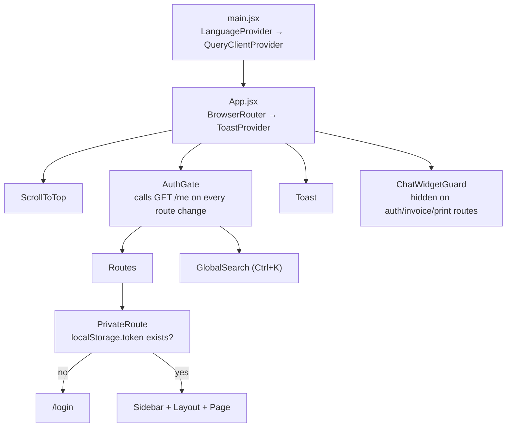

# MultiDukkan — Frontend Guide

The frontend is a **separate repository**: `multidukkan-frontend`, a sibling directory to this one.
This guide documents it from the backend developer's point of view — enough to trace a change from
the UI to the API and back, and to know which files to touch. It was read on 2026-08-30 at
`../multidukkan-frontend`.

That repo has its own `CLAUDE.md` (17 KB) covering its internal conventions in more depth. This
document is the map, not the replacement.

Labels: ✅ Confirmed · 🔍 Inferred · ❓ Unclear · ⚠️ Potential issue.

---

## 1. Stack

| Concern | Choice |
|---|---|
| Framework | React **19** |
| Build | Vite 8 |
| Routing | react-router-dom **7**, `BrowserRouter` |
| Server state | **TanStack React Query v5** |
| HTTP | axios, one shared instance |
| Styling | Tailwind CSS 3 + a few Radix UI primitives (`components/ui/`) |
| Icons | lucide-react |
| Charts | recharts |
| i18n | **hand-rolled** — no i18next, no react-intl |
| Client state | `useState` + `localStorage`/`sessionStorage`. **No Redux, no Zustand, no Context for data.** |

The only React Context in the app is `LanguageProvider` (language) and `ToastProvider`
(notifications). Everything else is either server state (React Query) or local component state. ✅

---

## 2. Directory layout

```
src/
├── api/axios.js              THE single HTTP client. Every request goes through it.
├── App.jsx                   All routes + AuthGate + PrivateRoute.
├── main.jsx                  Providers: LanguageProvider → QueryClientProvider → App.
├── components/               25 shared components + ui/ (7 Radix wrappers).
├── hooks/
│   ├── useToast.jsx          ToastProvider + useToast().
│   └── useKeyboardShortcuts.js   'n' → new order, Ctrl+K → global search.
├── i18n/
│   ├── translate.js          Pure lookup + interpolation. No React.
│   ├── index.jsx             LanguageProvider — owns lang, syncs <html lang/dir>.
│   ├── useTranslation.js     The hook every component calls.
│   ├── ar/  en/              19 namespace files each, mirrored.
├── lib/
│   ├── format.js             formatCurrency / formatDate / formatDateTime / formatTime.
│   ├── enums.js              Canonical backend enum values.
│   ├── auditLog.js           Activity-feed display helpers.
│   └── utils.js              cn() classname merger.
└── pages/                    30 pages, one per route.
```

**Deliberately absent**: no `services/` or `api/` module per resource, no generated API client, no
form library, no schema validation. Pages call `api.get('/orders')` directly. 🔍 For a codebase this
size that is a reasonable trade — the cost is that endpoint URLs are scattered across 40 files, so a
route rename is a grep-and-replace.

---

## 3. The API layer — `src/api/axios.js`

One axios instance, one request interceptor, and that is the entire integration.

```js
baseURL: 'http://multidukkan.test/api'
withCredentials: true
headers: { 'Content-Type': 'application/json', Accept: 'application/json' }
```

The interceptor attaches three things to **every** request:

| Header | Value | Backend consumer |
|---|---|---|
| `Authorization` | `Bearer ${localStorage.token}` | `auth:sanctum` |
| `X-Locale` | stored language, validated against `['en','ar']` | `SetLocale` middleware |
| `X-Timezone` | `Intl.DateTimeFormat().resolvedOptions().timeZone`, in a try/catch | `SetTimezone` middleware |

`Accept: application/json` matters: without it Laravel returns HTML error pages instead of JSON.

⚠️ **`baseURL` is hardcoded to the local Herd domain.** There is no `.env` / `import.meta.env`
switch, so a production build needs this line edited. Worth fixing before the first deploy.

⚠️ **There is no response interceptor.** A 401 from an expired token is not globally handled — only
`AuthGate`'s `/me` call clears the token, and only on route change. Every other 401 surfaces as a
generic toast. 🔍

---

## 4. Routing and authentication



**`PrivateRoute`** is deliberately dumb: it only checks that a token string exists in
`localStorage`. It does **not** check roles or onboarding state.

**`AuthGate`** does the real work, on **every route change**:
1. `GET /me` — fresh user data, not the stale `localStorage` copy.
2. Writes the response back to `localStorage.user`.
3. If `role === 'tenant_admin' && !has_store` and you're not already on an auth page → redirect to
   `/onboarding`.
4. On failure → clear `token` and `user`.

The code comment explains the "fresh data" choice: an earlier version read `localStorage` and
redirected existing admins to onboarding incorrectly. ✅

⚠️ **`/me` fires on every navigation**, uncached — one extra round-trip per page change. React Query
is right there and unused for this call. 🔍

**Authorization in the UI**: components read
`JSON.parse(localStorage.getItem('user') || '{}')` and branch on `user.role` / `user.store_id`.
There is no route-level role guard. That is fine — **the backend is the authority**; the frontend only
hides things it knows the API will refuse. Never treat a hidden button as a permission.

**Route shape**: every authenticated page is wrapped inline as
`<PrivateRoute><Sidebar /><Layout><Page /></Layout></PrivateRoute>`. Four routes deliberately skip
`Sidebar`/`Layout` because they are print targets: `/orders/:id/invoice`,
`/purchase-orders/:id/invoice`, `/reports/print`, and `/onboarding`.

---

## 5. How a typical page works

```
Page mounts
  → useQuery(['orders', {filters}])            server state, cached + deduped
  → render from data?.data, data?.meta, data?.stats
  → user acts (submit a payment)
  → async handler calls api.post('/payments', {...})     ← raw axios, NOT useMutation
  → showToast(...) on success or error
  → queryClient.invalidateQueries({ queryKey: ['orders'] })
  → React Query refetches → UI updates
```

### Why each step exists

| Step | Why |
|---|---|
| `useQuery` with the filters **in the key** | Changing a filter is a different query, so it gets its own cache entry. `placeholderData: keepPreviousData` keeps the old page visible while the new one loads instead of flashing a spinner. |
| Reading `data?.data` / `data?.meta` / `data?.stats` | The backend's list endpoints return that three-part envelope (see §7). |
| Raw `api.post` in the handler | Gives the page direct control over toasts, redirects and per-field error display. |
| `showToast` | The only feedback channel — there are no inline field errors in most forms. 🔍 |
| `invalidateQueries` | React Query has no idea a POST changed anything. This is the manual cache-coherence step, and **forgetting it is the #1 "why didn't the UI update?" bug** in this codebase. |

### ⚠️ The pattern gap: `useMutation` is used **nowhere**

26 of 30 pages use `useQuery`. **Zero** use `useMutation`. Every write is a hand-rolled
`try/catch/finally` with a `saving` boolean.

What that costs, concretely:
- Loading state is manual (`const [saving, setSaving] = useState(false)`), repeated on every form.
- No automatic retry, no optimistic updates, no rollback.
- Cache invalidation is manual and therefore skippable.
- The same `err.response?.data?.message || t('…failed')` expression is copy-pasted across ~30 files.

This is the single biggest structural improvement available on the frontend, and it is a mechanical
refactor. It is **not** urgent — the current pattern works — but if you touch several forms in one
sitting, converting them is worth it.

### Two nice touches worth knowing about

- **Draft persistence**: `CreateOrder.jsx` writes its in-progress cart to
  `sessionStorage['createOrderDraft']` and restores it on mount. A refresh mid-sale doesn't lose the
  basket.
- **Remembered default store**: `localStorage['default_store_id']` — a tenant admin's last-used store
  is preselected next time.

---

## 6. Forms and validation

There is **no form library and no client-side schema validation.** ✅ Forms are controlled
`useState` fields plus a few `required` attributes and hand-written guards in the submit handler.

**The backend is the validator.** A 422 comes back and its `message` is toasted. This is why
`SetLocale` matters so much: the user sees the API's Arabic validation message verbatim.

Trade-off, stated honestly: fewer round-trips would be nicer, and field-level error highlighting is
mostly absent. But there is exactly **one** validation implementation, so the UI can never disagree
with the API about what's allowed. For a money app that is the right side of the trade. 🔍

**Enum discipline** — `src/lib/enums.js` is a good pattern to follow:

```js
// Canonical backend enum values, in the order they should be listed in the UI.
// These are API contract values — send them raw, and render them through
// t(`enums.<group>.${value}`). Never send a translated label to the API.
export const EXPENSE_CATEGORIES = ['SALARIES', 'RENT', ...]   // mirrors Expense::CATEGORIES
```

Raw value on the wire, translated label on screen. If you add a backend enum, mirror it here.

---

## 7. The API response contract

Three shapes exist, and knowing which you're getting saves a lot of `console.log`:

**A. Paginated list with stats** — orders, customers, suppliers, purchase orders, inventory, expenses:
```jsonc
{
  "data":  [ … ],
  "meta":  { "current_page": 1, "last_page": 4, "total": 37 },
  "stats": { … },          // endpoint-specific
  "years": [2026], "months": [ … ]   // orders / purchase orders only
}
```

**B. Plain Resource collection** — products, warehouses. Laravel's default envelope:
`{ "data": [ … ] }`, with pagination meta only when paginated.

**C. Bespoke JSON** — dashboard, reports, search, audit log, ledger summaries. Hand-built arrays.

⚠️ Shapes B and C are why you'll see both `res.data.data` and `res.data` in the pages. There is no
single unwrapping helper. Check the controller before assuming.

**`per_page=all`** is a real backend feature on `/products` and `/inventory` (and `/suppliers`) —
used by `CreateOrder` and `QuickSaleModal`, which need the full catalogue in memory to do
client-side product search. ⚠️ This scales linearly with the catalogue and will be the first thing to
hurt on a large tenant.

---

## 8. Internationalisation

Hand-rolled, ~80 lines total, and genuinely well built. **Arabic is the default.**

### How it works

```
src/i18n/translate.js       pure: bundles, DEFAULT_LANG='ar', translate(lang, key, params)
src/i18n/index.jsx          LanguageProvider — owns `lang`, syncs <html lang> and <html dir>
src/i18n/useTranslation.js  const { t, lang, dir, setLang } = useTranslation()
src/i18n/{ar,en}/*.js       19 mirrored namespace files
```

- **Dot-path lookup**: `t('orders.payModal.success')`.
- **Interpolation**: `{name}` placeholders, replaced by `params`. React escapes the output.
- **Missing key** → returns the key itself and `console.warn`s in dev. A gap is visible but never
  crashes a page.
- **No browser-language detection** — deliberate, with a comment: a browser set to English would
  otherwise silently flip an existing Arabic user's UI.

### RTL

`LanguageProvider` sets `document.documentElement.dir = lang === 'ar' ? 'rtl' : 'ltr'`. Tailwind's
logical properties handle most of the layout. Components that need direction read `dir` from the hook
— e.g. `CreateOrder` picks `ChevronLeft` vs `ChevronRight` for a hint arrow based on it.

### Adding a string

1. Add the key to `src/i18n/ar/<namespace>.js` **and** `src/i18n/en/<namespace>.js`.
2. If it's a new namespace, register it in **both** `src/i18n/ar/index.js` and `en/index.js`.
3. Use `t('namespace.key')`.

Miss the English file and English users see the raw key. There is no CI check for this. ⚠️

---

## 9. Timezone handling on the client

The frontend's job is small and specific: **tell the backend which calendar day it's in, and render
UTC instants in the local zone.** It never converts anything itself.

| Direction | Mechanism |
|---|---|
| Out | `X-Timezone: <IANA zone>` on every request, from `Intl.DateTimeFormat().resolvedOptions().timeZone` |
| In | Timestamps arrive as ISO-8601 with `Z`; `new Date(value)` + `toLocaleString(...)` renders local |
| Date pickers | `new Date().toLocaleDateString('en-CA')` → `YYYY-MM-DD` in **local** time, sent as a plain string |

That `en-CA` trick appears in `CreateOrder` (default `order_date`) and `Orders` (the "today" filter).
It matters: `toISOString().slice(0,10)` would give the **UTC** date and be wrong for the first three
hours of every Cairo morning.

`src/lib/format.js` owns all rendering. Two decisions worth knowing:
- Both languages use **Western numerals** (`ar-EG-u-nu-latn`) — the approved style for this Arabic
  UI. Only the currency symbol and its side change with language.
- `hour12: true` is set explicitly, because `en-GB` defaults to 24-hour and `ar-EG` to 12-hour, so
  without it the same screen would read differently in each language.

---

## 10. Component inventory

**Layout / navigation**: `Layout`, `Sidebar`, `BackButton`, `ScrollToTop`, `LanguageSwitcher`.

**Feedback**: `Toast` + `useToast`, `LoadingSpinner`, `Modal`, `DeleteModal`.

**Domain modals** — these carry real business meaning, not just presentation:

| Component | Endpoint | Note |
|---|---|---|
| `QuickSaleModal` | `POST /orders` with `pay_immediately: true` + walk-in customer | **The whole of Quick Sale.** There is no separate backend flow. |
| `RefundModal` | `POST /customers/{id}/refund` | Chooses between payment-target and order-level refund |
| `AddCreditModal` | `POST /customers/{id}/credit` | Manager+ only |
| `AddItemModal` | `POST /orders/{id}/items` | Subject to `ensureOrderIsEditable` |
| `ExpenseModal` | `POST`/`PATCH /expenses` | |
| `ReverseSupplierPaymentModal` | `DELETE /supplier-payments/{id}` | Full void, no partial |
| `AuditLogDrawer` | `GET /audit-log/inventory-batches/{batchId}` | Expands a batched activity row |

**Search inputs** — `ProductSearchInput`, `CustomerSearchInput`, `SupplierSearchInput`,
`OrderSearchInput` (client-side over preloaded lists), `SearchInput` (debounced server search),
`GlobalSearch` (Ctrl+K, hits `GET /search`).

**Other**: `SupplierMultiSelect` (drives `supplier_ids[]` on the product form), `StatBoxes`,
`ChatWidget` (→ `POST /ai/chat`, hidden on auth/invoice/print routes).

---

## 11. Tracing a change end to end

**"The order list shows the wrong unpaid total."**

```
src/pages/Orders.jsx
  → reads data.stats.unpaid_amount
  → useQuery key ['orders', {…}] → GET /api/orders
      ↓ backend
routes/api.php                  → OrderController@index
app/Http/Controllers/…/OrderController::index
  → $totalRevenue = sum('total')
  → $paidAmount   = Payment::…->cashOnly()->sum(amount - refunded_amount)
  → $unpaidAmount = $totalRevenue - $paidAmount
```

The bug is in the controller, and it is real: `cashOnly()` excludes store-credit payments, so an
order settled with credit still counts as unpaid in that statistic — while `Order::whereUnpaid()`
(used by the dashboard) counts credit payments. Two definitions of "unpaid" in one feature. See
[CODEBASE_NOTES.md](CODEBASE_NOTES.md) #8. **The fix belongs in the backend, not in `Orders.jsx`.**

That is the general lesson: when a number looks wrong, follow it to the controller or service. The
frontend renders numbers; it should never compute them.

---

## 12. Conventions to follow

**Do:**
- Import the shared `api` instance — never create an axios call by hand.
- Put every filter that changes the result **inside** the React Query key.
- `invalidateQueries` after every successful write.
- Route every user-facing string through `t()`, and add both `ar` and `en`.
- Format money with `formatCurrency(value, lang)` — never `toFixed(2)` inline.
- Send raw backend enum values; translate only for display.
- Let the backend validate. Show its message.

**Don't:**
- Compute a balance, a total, or an order status in a component. Those come from the API.
- Trust `localStorage.user` for authorization — it's a UI hint, and it can be edited by hand.
- Add a new state library. `useState` + React Query covers everything here.
- Use `toISOString().slice(0,10)` for a date field — it's UTC, and it will be off by a day.

---

**Related documents**: [DEVELOPER_GUIDE.md](DEVELOPER_GUIDE.md) §5 for the backend flows behind
these pages, §8 for the full timezone model; [CODEBASE_NOTES.md](CODEBASE_NOTES.md) for the ranked
issue list; `../multidukkan-frontend/CLAUDE.md` for that repo's own conventions.
**Future improvements**: move `baseURL` to an env var before deploying; add a response interceptor
for global 401 handling; convert writes to `useMutation`; cache `/me`.
**Open questions**: should the frontend guide live here or in `multidukkan-frontend`?
[README.md](README.md) currently answers "the frontend repo, with stubs here" — this document is a
deliberate exception, because a backend developer tracing a bug needs it on this side.
**Last review checklist**: [ ] route list matches `App.jsx`, [ ] response-shape table matches the
controllers, [ ] i18n namespace list current. Last reviewed: 2026-08-30.
