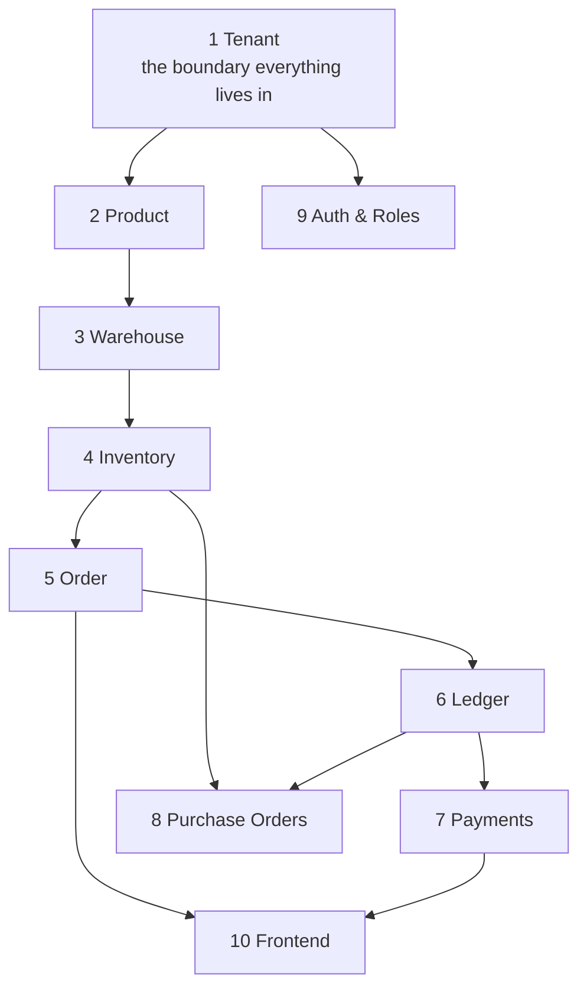

# MultiDukkan — Learning Path

A ten-step route through your own codebase, designed so each step only needs what came before it.

**Who this is for**: you, when individual files make sense but the whole system doesn't. The problem
isn't knowledge — you wrote this. The problem is that you learned it in the order you *built* it
(features as they were needed), which is not the order it *depends*. This path follows the dependency
order instead.

**How to use it**: one step per session, roughly 45–90 minutes each. Don't skip the exercises — the
questions are the point. If you can't answer one without opening a file, you haven't finished the
step.

---

## Why this order



Three principles behind the ordering:

1. **Containers before contents.** A product only makes sense inside a tenant; stock only makes sense
   inside a warehouse.
2. **Nouns before verbs.** Understand what an order *is* before what creating one *does*.
3. **The Order is the keystone.** It is the only operation that touches inventory, the ledger and
   payments at once. Everything before step 5 is preparation for understanding it; everything after
   is a variation on it.

Auth is step 9 — late on purpose. It cuts across every step, and it makes far more sense once you
know what it is protecting.

---

## Step 1 — Tenant

**Concept**: multi-tenancy — many businesses, one deployment, zero leakage.

**Read** (in this order):
- `app/Models/Concerns/ScopedToTenant.php` — 30 lines, the most important 30 in the repo
- `app/Rules/BelongsToTenant.php`
- `app/Http/Controllers/Api/V1/AuthController.php::register`
- `tests/Feature/TenantScopeTest.php`
- [DOMAIN_RULES.md](DOMAIN_RULES.md) §1

**Understand**:
- The difference between *authenticated* and *allowed*.
- Four independent isolation layers, and why redundancy is the design rather than sloppiness.
- Why the global scope **cannot** be the only layer.

**Answer without looking:**
1. A `store_staff` from Tenant A sends `product_id: 99` (Tenant B's product) in an order. Name every
   layer that stops it and the status code each returns.
2. `ScopedToTenant` no-ops in one situation. Which, and why is that necessary rather than a bug?
3. Why does `register` create a customer called "زبون نقدي"?
4. `order_items` has no `tenant_id`. Is that a hole? Justify your answer.

**Exercise**: without running anything, predict what
`Product::withoutGlobalScope('tenant')->count()` returns in a test with two tenants each having 3
products. Then verify against `test_the_scope_can_be_lifted_deliberately`.

**Done when**: you can explain to a non-developer why a logged-in user still can't see another shop's
data — and name four separate reasons.

---

## Step 2 — Product

**Concept**: the catalogue, and the two ideas that complicate everything downstream — price tiers and
dual units.

**Read**:
- `app/Models/Product.php`
- `database/migrations/2026_03_01_210749_create_products_table.php` and the `add_*` migrations that
  follow it — read them in date order; the product's history *is* the product's design
- `app/Services/ProductService.php`
- `app/Http/Resources/ProductResource.php`
- [`06-domain/products-and-units.md`](06-domain/products-and-units.md)

**Understand**:
- Six prices: `price` + `price_a`…`price_e`, all nullable and falling back to `price`.
- `conversion_factor`: a "box of 12" is one product with two units, **not** two products.
- `cost_price` is a *weighted average per base unit* maintained by purchasing, not something you set.
- The rule that governs everything from here on: **stock is always stored in base units.**

**Answer without looking:**
1. A product has `price = 10`, `price_b = 8`, `price_c = null`. What does a tier-`c` customer pay, and
   which line of code decides?
2. `conversion_factor = 12`, base unit `pcs`, secondary `box`. Selling 3 boxes deducts how much stock?
3. Why is `opening_quantity` stored on the product but never read after creation?
4. What is the difference between `products.cost_price` and `supplier_products.cost_price`?

**Exercise**: trace one field — `secondary_unit` — through every layer: migration → model →
FormRequest → service → resource → frontend form. Count the files. That number is the real cost of
adding a product field, and it's why [DEVELOPER_GUIDE.md](DEVELOPER_GUIDE.md) §11 exists.

---

## Step 3 — Warehouse

**Concept**: where stock physically is, and how store scoping differs from tenant scoping.

**Read**:
- `app/Models/Warehouse.php`, `app/Models/Store.php`
- `app/Http/Controllers/Api/V1/WarehouseController.php`
- `app/Policies/WarehousePolicy.php`
- `app/Observers/StoreObserver.php`

**Understand**:
- Tenant → Store → Warehouse → Inventory. Stock belongs to a warehouse, never to a store or product
  directly.
- Store scoping (`user.store_id`) is a **visibility** rule inside one tenant, applied ad hoc in
  controllers. It is not an isolation boundary. Don't conflate the two.
- Why `StoreObserver::deleting` refuses to delete the last store.

**Answer without looking:**
1. A `store_manager` at Store 1 calls `GET /warehouses`. What do they get, and which line filters it?
2. Why can't a warehouse holding stock be deleted — and what happens to its `inventory_transactions`
   when an *empty* one is?
3. What does `tenant_admin` having `store_id = null` actually cause, mechanically?

**Exercise**: read [DOMAIN_RULES.md](DOMAIN_RULES.md) §7 on warehouse deletion, then decide for
yourself: should `inventory_transactions.warehouse_id` be `CASCADE` or `RESTRICT`? Write down your
reasoning in two sentences. This is a real open decision — your answer matters.

---

## Step 4 — Inventory

**Concept**: current state plus an append-only movement log, and why it's that instead of pure event
sourcing.

**Read**:
- `app/Services/InventoryService.php` — the whole file, it's 173 lines
- `app/Models/Inventory.php`, `app/Models/InventoryTransaction.php`
- `tests/Feature/InventoryTest.php`
- [`07-business-rules/costing-and-inventory-rules.md`](07-business-rules/costing-and-inventory-rules.md)

**Understand**:
- `inventory.quantity` = the claim. `inventory_transactions` = the evidence.
- The current quantity is **authoritative for reads** — nothing replays the log. So this is
  state-with-an-audit-log, not event sourcing, and the trade-off is fast reads for undetectable
  drift.
- The five mutation methods and why `deductStock`/`restoreStock` use `firstOrFail` while
  `ensureStockRow` exists separately.
- `unsignedInteger` as the last line of defence against negative stock.

**Answer without looking:**
1. Why can't `deductStock` create a missing inventory row? Which caller is allowed to, and why that
   one?
2. What is `batch_id` for, and what breaks in the UI without it?
3. Give a sequence of two concurrent requests where `checkStock` passes for both. What stops actual
   corruption?
4. Why does `adjustStock` convert secondary units but `deductStock` does not?

**Exercise**: read `OrderService::adjustItem` (line 344) side by side with `cancelOrder` (line 505).
Both change stock for an existing order item. Find the difference. Then read
[CODEBASE_NOTES.md](CODEBASE_NOTES.md) #1 — but **find it yourself first**. This is the single best
five minutes in this whole path.

---

## Step 5 — Order (the keystone)

**Concept**: one business event fanning out into six tables, atomically.

**Read**, in this exact order:
1. `app/Http/Requests/StoreOrderRequest.php`
2. `app/Http/Controllers/Api/V1/OrderController.php::store`
3. `app/Services/OrderService.php::createOrderAttempt` — **slowly, twice**
4. `app/Http/Resources/OrderResource.php`
5. [DEVELOPER_GUIDE.md](DEVELOPER_GUIDE.md) §5.1 and §6
6. `tests/Feature/LedgerTest.php`, `tests/Feature/OrderMoneyTest.php`

**Understand**:
- The transaction boundary: what must succeed or fail together, and why.
- Aggregation vs validation — and the two *different* groupings over the same lines.
- Snapshots (ADR-005): why an invoice never re-joins live product data.
- Stored `total` vs derived `status` (ADR-004).
- `order_date` vs `created_at`.

**Answer without looking:**
1. Why is stock aggregated by `product + warehouse` for the check, but merged by
   `product + warehouse + unit_type` for the rows? Give a concrete case where using one key for both
   breaks something.
2. Order for 100, customer has 60 credit. Exactly which rows are written, in which tables?
3. `order.status` is never stored. Where does the frontend's "paid" badge come from?
4. What does `manual_total` do, and what happens to it when someone later edits an item?
5. Why does `OrderObserver::updated` return early when `wasRecentlyCreated` is true?

**Exercise**: on paper, without opening the file, list every table row created by a single
`POST /orders` for a 2-line order from a customer with no credit, `pay_immediately: false`. Then
check. (Answer: 1 order + 2 order_items + 2 inventory updates + 2 inventory_transactions +
1 ledger_entry. Zero audit_logs — and knowing *why* zero is the real test.)

**Done when**: you can draw the whole flow on a whiteboard from memory.

---

## Step 6 — Ledger

**Concept**: append-only financial history, with balances derived from it and stored nowhere.

**Read**:
- `app/Services/LedgerService.php` — the whole file
- `app/Models/LedgerEntry.php`
- [`06-domain/ledger.md`](06-domain/ledger.md), [`ADR-003`](01-architecture/decisions/ADR-003-ledger-single-source-of-truth.md),
  [`ADR-006`](01-architecture/decisions/ADR-006-ledger-mutability-boundaries.md)
- `tests/Feature/LedgerTest.php`, `tests/Feature/BalanceVerificationTest.php`

**Understand**:
- The ten entry types and which side of the balance each falls on — and *why* each one falls there.
- Why `REFUND` is a **debit** (this trips everyone up).
- Why append-only, and the two sanctioned exceptions.
- The two schemas in one table (customer `type`-based vs supplier `direction`-based).

**Answer without looking:**
1. Why does spending store credit write **two** ledger entries (`PAYMENT` and `CREDIT_CONSUMED`)?
   What breaks with only one?
2. Why is `REFUND` a debit? Explain it as you would to your father.
3. When would `getBalance()` and `getCreditBalance()` disagree about whether a customer has credit?
4. What is the founding sin ADR-003 was written about, and why is finding #11 in
   [CODEBASE_NOTES.md](CODEBASE_NOTES.md) the same sin in disguise?

**Exercise**: on paper, write every ledger entry for this sequence, then compute the balance after
each:
```
1. Customer has 50 credit
2. Order for 200
3. Direct payment of 100 cash
4. Refund 40 of that payment
5. Cancel the order
```
Then verify by reading `cancelOrder` line by line. If your number differs, the ledger is right and
your model is wrong — find where.

---

## Step 7 — Payments

**Concept**: FIFO application, overpayment→credit, and correctness under concurrency.

**Read**:
- `app/Services/PaymentService.php` — including every comment; they carry the reasoning
- `app/Models/Order.php::scopeWhereUnpaid`, `settledAmount()`, `cashReceived()`
- `LedgerService::issueRefund`, `refundableForOrder`, `refundableForPayment`
- `tests/Feature/DirectPaymentTest.php`, `AutoPaymentTest.php`
- [`06-domain/payments-and-credit.md`](06-domain/payments-and-credit.md)

**Understand**:
- Three payment paths, one policy: oldest first, leftover becomes credit.
- `is_auto_reversible` — what a store-credit payment is and why it can never be cash-refunded.
- `refunded_amount` as a running counter every refundability check reads.
- The `lockForUpdate` reasoning. This is the hardest part of the codebase; take your time.

**Answer without looking:**
1. Explain FIFO to a shopkeeper in one sentence.
2. Why must `Order::lockForUpdate()->findOrFail()` be the **first** query in
   `processDirectPayment`'s transaction? What goes wrong if a plain read comes first?
3. `settledAmount()` vs `cashReceived()` — which question does each answer, and where is each used?
4. Customer pays 500 with three unpaid orders of 200, 150 and 100. What exists in the database
   afterwards?

**Exercise**: read the `lockForUpdate` comment in `applyFifo` (line 212) until you can explain
REPEATABLE READ snapshot pinning without the comment. Then look at `SupplierPaymentService` and
decide whether it has the same problem. (It does — [CODEBASE_NOTES.md](CODEBASE_NOTES.md) #12.)

---

## Step 8 — Purchase Orders

**Concept**: the mirror image of an order — stock in, supplier debt out — plus weighted-average
costing.

**Read**:
- `app/Services/PurchaseOrderService.php`
- `app/Services/SupplierPaymentService.php`
- `app/Models/Supplier.php::syncProducts`, `app/Models/Product.php::syncSuppliers`
- [`ADR-008`](01-architecture/decisions/ADR-008-weighted-average-costing.md),
  [`06-domain/suppliers-and-purchase-orders.md`](06-domain/suppliers-and-purchase-orders.md)
- `tests/Feature/PurchaseOrderMoneyTest.php`, `SupplierProductPivotTest.php`

**Understand**:
- Compare `createPurchaseOrderAttempt` with `createOrderAttempt` line by line. Same skeleton,
  opposite direction — this comparison teaches more than either file alone.
- The weighted-average formula, and why `$runningStock`/`$runningCost` exist.
- `unit_price` (as invoiced) vs `costPerBaseUnit` (averaged).
- Many-to-many suppliers ↔ products, and why `products.supplier_id` would be wrong.
- The two `sync` helpers behave **differently** — `syncProducts` is additive, `syncSuppliers`
  replaces.

**Answer without looking:**
1. Buy 10 boxes of 12 at 120 EGP/box. Stock was 60 units at cost 9. What is the new `cost_price`?
   Show your working.
2. Why does the average use stock across **all** warehouses rather than the receiving one?
3. Why is `Supplier::syncProducts` additive while `Product::syncSuppliers` detaches?
4. What happens to `cost_price` when a purchase order is cancelled? Is that right?

**Exercise**: give three concrete reasons `products.supplier_id` would be wrong, using your father's
actual shop as the example. Then read [DOMAIN_RULES.md](DOMAIN_RULES.md) §6 and see if you got all
three.

---

## Step 9 — Auth & Roles

**Concept**: who may do what — deliberately late, because now you know what's being protected.

**Read**:
- `app/Http/Controllers/Api/V1/AuthController.php`
- All 11 files in `app/Policies/` — in one sitting, they're short
- `app/Providers/AppServiceProvider.php::boot`
- `tests/Feature/RoleTest.php`, `ExpenseTest.php`
- [DEVELOPER_GUIDE.md](DEVELOPER_GUIDE.md) §10, [`ADR-001`](01-architecture/decisions/ADR-001-sanctum-token-auth.md),
  [`ADR-002`](01-architecture/decisions/ADR-002-string-role-column.md)

**Understand**:
- Sanctum tokens; why not cookie mode.
- Every policy method: tenant check **first**, role check second. Notice the ordering is universal.
- Role vs store scoping — two different axes.
- `ExpensePolicy` is the most sophisticated one (tenant + store + ownership). Read it twice.

**Answer without looking:**
1. Why can a `store_manager` create warehouses but not products?
2. Two mechanisms restrict a `store_manager` to their own store. Name both and say where each lives.
3. Where do the audit-log endpoints check permissions, and why is it done differently there?
4. `store_staff` calls `GET /dashboard`. What is missing from the response, and where is that decided?

**Exercise**: pick any endpoint and list every check between the HTTP request and the first database
write, in order. Then confirm against [DEVELOPER_GUIDE.md](DEVELOPER_GUIDE.md) §6.

---

## Step 10 — Frontend

**Concept**: how the UI consumes all of the above.

**Read** (in `../multidukkan-frontend`):
- `src/api/axios.js` — the entire integration, in one file
- `src/App.jsx` — routing + `AuthGate`
- `src/pages/Orders.jsx` — the canonical list page
- `src/pages/CreateOrder.jsx` — the most complex form
- `src/components/QuickSaleModal.jsx`
- `src/i18n/translate.js`, `src/lib/format.js`
- [FRONTEND_GUIDE.md](FRONTEND_GUIDE.md)

**Understand**:
- React Query for reads, raw axios for writes, `invalidateQueries` as the manual coherence step.
- The three response shapes and why `res.data.data` sometimes isn't right.
- `X-Locale` and `X-Timezone` — what the backend does with each.
- Quick Sale is **not** a separate backend flow.

**Answer without looking:**
1. Why must the filters be inside the React Query key?
2. What happens if you forget `invalidateQueries` after a POST?
3. What does the backend do with `X-Timezone`, and what does it explicitly *not* do?
4. Why `toLocaleDateString('en-CA')` instead of `toISOString().slice(0,10)`?
5. Where does Quick Sale's "walk-in customer" come from?

**Exercise**: pick a number on the Orders screen and trace it backwards to the exact SQL that
produced it. [FRONTEND_GUIDE.md](FRONTEND_GUIDE.md) §11 does this for `unpaid_amount` — do it for
`total_revenue` yourself, then explain why those two are computed with different definitions of
"paid".

---

## Step 11 (bonus) — Timezones

Not in the dependency chain, but it cuts across everything and it's the area where a wrong assumption
produces silently-wrong reports.

**Read**: `app/Support/LocalDateRange.php` (read the docblocks — they're the design document),
`app/Http/Middleware/SetTimezone.php`, `config/app.php` lines 60–105,
`tests/Feature/TimezoneTest.php`, [DEVELOPER_GUIDE.md](DEVELOPER_GUIDE.md) §8.

**Answer without looking:**
1. Name the three timezones and the question each one answers.
2. Why does `businessTimezone()` deliberately ignore the request?
3. `apply()` vs `applyCalendarDate()` — when does each apply, and what breaks if you swap them?
4. Why is invoice numbering resolved in the shop's timezone rather than UTC?
5. Why `DATETIME` and not `TIMESTAMP`?

**Exercise**: an order is created at 01:30 Cairo time on 1 January 2027. What is its `created_at`,
its `order_date`, and its invoice number's year prefix? Verify against
`test_order_invoice_uses_the_business_year_across_new_year`.

---

## The final exam

You've finished when you can answer all thirteen without opening a file:

1. Explain MultiDukkan to a non-developer in three sentences.
2. Trace an order from a button click to the database.
3. Why does `InventoryService` exist?
4. Why does `LedgerService` exist? (Name the bug.)
5. Aggregation vs validation — and why two different groupings in `createOrderAttempt`?
6. How is tenant isolation enforced? Name four layers.
7. Why is inventory history append-only?
8. Why is financial history append-only, and what are the two exceptions?
9. Which entities may be hard-deleted, and what guards each?
10. Why is supplier ↔ product many-to-many?
11. Explain the three-timezone model.
12. You need to change how stock is deducted. Which file, and what must you not forget?
13. Name three things in this codebase that look like bugs but are deliberate.

---

## After the path — one habit worth keeping

Every time you fix something in [CODEBASE_NOTES.md](CODEBASE_NOTES.md), delete the entry. Every time
you find something new, add it with a severity. Every time an ADR and the code disagree, write the
superseding ADR rather than editing the old one.

That maintenance loop is what keeps these documents worth reading in six months — and the reason you
got lost in your own codebase in the first place is that the system grew faster than the notes about
it did.

---

**Related documents**: [DEVELOPER_GUIDE.md](DEVELOPER_GUIDE.md) (the reference this path teaches you
to navigate), [DOMAIN_RULES.md](DOMAIN_RULES.md), [DATABASE_GUIDE.md](DATABASE_GUIDE.md),
[FRONTEND_GUIDE.md](FRONTEND_GUIDE.md), [ARCHITECTURE_DECISIONS.md](ARCHITECTURE_DECISIONS.md),
[CODEBASE_NOTES.md](CODEBASE_NOTES.md).
**Future improvements**: add a step for stock transfers when Phase 3 lands.
**Open questions**: none.
**Last review checklist**: [ ] file paths still exist, [ ] exercises still have correct answers,
[ ] step order still matches the dependencies. Last reviewed: 2026-08-30.
