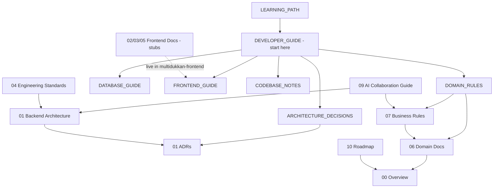

# MultiDukkan Engineering Documentation

This directory is the **operating system of the project**: the long-lived decisions, domain rules, and conventions that survive individual coding sessions. It is written primarily for two audiences:

1. **Future developers** joining the project.
2. **Future AI sessions** (Claude Sonnet, Claude Opus, ChatGPT) modifying this codebase. If you are an AI agent, read [`09-ai-collaboration/ai-collaboration-guide.md`](09-ai-collaboration/ai-collaboration-guide.md) **before writing any code**.

## Ground rules for this documentation

- **Docs describe reality, not aspiration.** Every rule here was verified against the actual code at the time of writing. When code and docs disagree, the code is probably newer — fix the doc, then the code if needed.
- **One topic per file.** No mega-documents.
- **Tiered by honesty.** Tier 1 docs are fully written and grounded in existing code. Tier 2 are designed-but-stubbed (they belong to work that doesn't exist yet, or to the `multidukkan-frontend` repo). Nothing here documents fantasy features.
- **Every doc ends with**: Related documents / Future improvements / Open questions / Last review checklist.

## Documentation map

## Directory index

### Tier 0 — orientation: read these when you are lost

Wide, cross-cutting guides that map the whole system. The Tier 1 docs below go *deeper* on individual
topics; these tell you which one to open. Written 2026-08-30 by reverse-engineering the code, with
every claim labelled Confirmed / Inferred / Unclear / Potential issue.

| Document | Purpose | Read it when |
|---|---|---|
| [DEVELOPER_GUIDE.md](DEVELOPER_GUIDE.md) | **Start here.** What the system is, the layers, the domain map, every business flow traced end to end, aggregation vs validation, timezones, audit logs, security, "where do I change X", testing | You are lost, or you are new |
| [DOMAIN_RULES.md](DOMAIN_RULES.md) | The invariants: tenant isolation, ledger and inventory append-only, stored vs calculated, FIFO, supplier↔product, and the full deletion / data-lifecycle rules | Before changing anything that could break a guarantee |
| [DATABASE_GUIDE.md](DATABASE_GUIDE.md) | Every table: purpose, columns, FK behaviour, indexes, mutable vs append-only, ERD | You are writing a migration or a query |
| [FRONTEND_GUIDE.md](FRONTEND_GUIDE.md) | React architecture, React Query patterns, API response shapes, i18n, client-side timezone handling | You are tracing a bug from the UI, or changing an API contract |
| [ARCHITECTURE_DECISIONS.md](ARCHITECTURE_DECISIONS.md) | The 8 ADRs summarised with trade-offs, **plus 11 decisions that have no ADR** | You are tempted to change something structural |
| [CODEBASE_NOTES.md](CODEBASE_NOTES.md) | Ranked findings: confusing areas, duplicated logic, suspicious code, and a table of things that look wrong but are deliberate | Before "fixing" something, and when picking up cleanup work |
| [LEARNING_PATH.md](LEARNING_PATH.md) | An 11-step route through the codebase in dependency order, with exercises | You want to understand the system rather than just navigate it |
| [MANUAL_QA.md](MANUAL_QA.md) | 12 end-to-end flows with the exact DB state each should produce, plus a bug log | Before a release, or when you want to verify a feature works rather than read about it |

### Tier 1 — written, grounded, load-bearing

| Document | Purpose | Audience | Update when | AI sessions that must read it |
|---|---|---|---|---|
| [00-overview/product-and-engineering-philosophy.md](00-overview/product-and-engineering-philosophy.md) | What MultiDukkan is, who it serves, what "good" means here | Everyone | Product direction changes | Any session touching product scope |
| [01-architecture/backend-architecture.md](01-architecture/backend-architecture.md) | Layers, dependency rules, request lifecycle | Backend devs, AI | New layer or cross-cutting pattern added | Any session writing PHP |
| [01-architecture/decisions/](01-architecture/decisions/) | ADRs — why locked decisions are locked | Backend devs, AI | Only via a new superseding ADR | Any session tempted to "refactor" a locked decision |
| [04-engineering-standards/coding-standards.md](04-engineering-standards/coding-standards.md) | Naming, validation, resources, service patterns | Backend devs, AI | Convention changes (rare) | Any session writing PHP |
| [04-engineering-standards/testing-strategy.md](04-engineering-standards/testing-strategy.md) | Test rules, what must be tested, patterns | Backend devs, AI | Test infra changes | Any session writing tests |
| [04-engineering-standards/api-conventions.md](04-engineering-standards/api-conventions.md) | URL shape, response shape, error shape | Backend + frontend devs, AI | New endpoint patterns | Any session adding endpoints |
| [04-engineering-standards/code-review-checklist.md](04-engineering-standards/code-review-checklist.md) | Yes/No/N-A gate run before every PR and every accepted AI change | Reviewers (human + AI) | New incident-born rule; automated items move to CI | **Every session, before declaring work done** |
| [06-domain/README.md](06-domain/README.md) | Entity map + ERD + multi-tenancy model | Everyone | New entity added | Any session touching models/migrations |
| [06-domain/customers.md](06-domain/customers.md) | Customer entity, tiers, walk-in, codes | Backend devs, AI | Customer schema changes | Sessions touching customers/orders/ledger |
| [06-domain/products-and-units.md](06-domain/products-and-units.md) | Products, price tiers, dual units, cost price | Backend devs, AI | Product schema changes | Sessions touching products/orders/POs |
| [06-domain/orders.md](06-domain/orders.md) | Orders, items, snapshots, invoice numbers | Backend devs, AI | Order schema/flow changes | Sessions touching orders |
| [06-domain/payments-and-credit.md](06-domain/payments-and-credit.md) | Payments, auto-payment, credit, refunds | Backend devs, AI | Payment flow changes | Sessions touching payments/ledger |
| [06-domain/ledger.md](06-domain/ledger.md) | The financial source of truth | Backend devs, AI | Ledger entry types change | **Every session touching money** |
| [06-domain/inventory-and-warehouses.md](06-domain/inventory-and-warehouses.md) | Stock, transactions, adjustments | Backend devs, AI | Inventory flow changes | Sessions touching stock |
| [06-domain/suppliers-and-purchase-orders.md](06-domain/suppliers-and-purchase-orders.md) | Suppliers, POs, supplier payments, costing | Backend devs, AI | Purchasing flow changes | Sessions touching purchasing |
| [07-business-rules/financial-calculations.md](07-business-rules/financial-calculations.md) | Every money formula, with the one true source | Backend devs, AI | Any formula changes | **Every session touching money** |
| [07-business-rules/order-lifecycle.md](07-business-rules/order-lifecycle.md) | Create → adjust → pay → cancel, step by step | Backend devs, AI | Order flow changes | Sessions touching orders |
| [07-business-rules/costing-and-inventory-rules.md](07-business-rules/costing-and-inventory-rules.md) | Weighted-average cost, unit conversion, stock rules | Backend devs, AI | Costing changes | Sessions touching POs/inventory |
| [09-ai-collaboration/ai-collaboration-guide.md](09-ai-collaboration/ai-collaboration-guide.md) | **Read first if you are an AI.** Non-negotiables, known divergences, decision process | AI sessions | Every incident where AI made a bad change | **All AI sessions** |
| [10-roadmap/roadmap.md](10-roadmap/roadmap.md) | Phases, what is deliberately NOT being built | Everyone | Each phase completion | Sessions asked to add features |

### Tier 2 — designed, stubbed, owned elsewhere or later

| Document | Status | Why stubbed |
|---|---|---|
| [02-design-system/README.md](02-design-system/README.md) | Stub | Design system belongs in `multidukkan-frontend`; stub defines what goes there |
| [03-ux-patterns/README.md](03-ux-patterns/README.md) | Stub | Same — UX patterns live with the React code |
| [05-frontend/README.md](05-frontend/README.md) | Stub | Superseded for orientation purposes by [FRONTEND_GUIDE.md](FRONTEND_GUIDE.md) (Tier 0), which documents the React app from a backend developer's point of view. Deep frontend conventions still live in `multidukkan-frontend/CLAUDE.md`. |
| [08-module-blueprints/README.md](08-module-blueprints/README.md) | Template only | Blueprints are written when a module is *about to be built*, not speculatively |

## Maintenance model

- **ADRs are immutable.** To change a decision, write a new ADR that supersedes the old one.
- **Domain and business-rule docs are living.** Update them in the same PR that changes the behavior. A PR that changes money math without updating `07-business-rules/` is incomplete.
- **The AI guide is an incident log with teeth.** When an AI session makes a mistake worth preventing, add it to the "common mistakes" section the same day.
- **Review cadence**: skim the Tier 1 index once per phase completion; deep-review money docs (`ledger.md`, `financial-calculations.md`) whenever a financial bug is found.

---

**Related documents**: everything above.
**Future improvements**: add `06-domain/stock-transfers.md` when Phase 3 transfers land; generate an OpenAPI spec and link it from `api-conventions.md`; promote the timezone model and the defence-in-depth tenant model to ADRs (see [ARCHITECTURE_DECISIONS.md](ARCHITECTURE_DECISIONS.md) Part B).
**Open questions**: should frontend docs live here (monorepo-style) or in `multidukkan-frontend`? Current answer: deep conventions in the frontend repo, a backend-developer-facing orientation guide here ([FRONTEND_GUIDE.md](FRONTEND_GUIDE.md)).
**Known doc/code divergences**: four documented in [CODEBASE_NOTES.md](CODEBASE_NOTES.md) #25 — two stale lines in the AI collaboration guide, and two ADRs (005, 007) that describe an implementation that was never fully built. Fix the first two; supersede the ADRs.
**Last review checklist**: [ ] index matches actual files, [ ] no doc describes removed behavior, [ ] AI guide reflects latest incidents. Last reviewed: 2026-08-30 (Tier 0 added).
